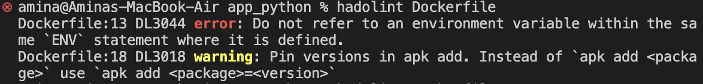

# Dockerfile Best Practices I Applied

1. Run rootless containers

1. Run containers without specific UID

1. Use `.dockerignore` file to exclude irrelevant files from build context

1. Make every executable in a container owned by the root user

1. Use multi-stage builds to get smaller Docker images and potentially a smaller attack surface

1. Order Dockerfile commands appropriately: it's crucial to keep the files that frequently change towards the end of the Dockerfile

1. Use trusted base images to reduce number of vulnerabilities

1. Use Python Virtual Environments in multi-stage build rather than building wheel files

1. Expose only the ports that your application needs

1. Minimize the amount of layers by grouping `RUN`, `COPY` and `ADD` instructions as they increase the size of build

1. Never put any secret or credentials in the Dockerfile instructions

1. Use COPY instead of ADD command, as it is more predictable and less error prone

1. Include metadata labels (with the application version, a link to the website, how to contact the maintainer)

1. Disable pip's caching as it wastes space, and you won't need it

1. Create ephemeral containers so that they can be stopped and destroyed, then rebuilt and replaced with an absolute minimum set up and configuration

1. Scan the images to detect potential problems

1. Use linting to detect bad practices in your Dockerfile

## Linters That I Used

While choosing linters for Dockerfile, I desided to select the most popular one, hadolint.
When I ran it for the first time6 it showed me this message:


The first error I fixed by spearating out the variables and using multiline assignment.

I had:

``` Dockerfile
    ENV VIRTUAL_ENV=/opt/venv \
    PYTHONDONTWRITEBYTECODE=1 \
    PATH="$VIRTUAL_ENV/bin:$PATH"
    ```
I changed to:

``` Dockerfile
    ENV VIRTUAL_ENV=/opt/venv \
    PYTHONDONTWRITEBYTECODE=1
    ENV PATH="$VIRTUAL_ENV/bin:$PATH"
    ```

The warning can be fixed if you add versions to:

``` Dockerfile
    RUN apk add --no-cache gcc musl-dev
    ```
