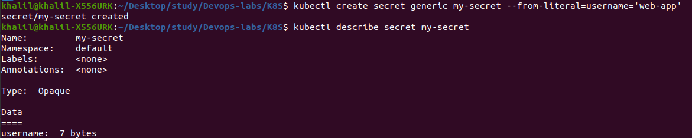
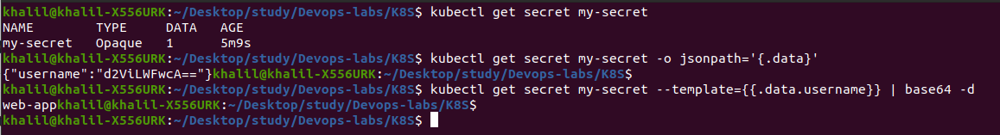

# K8s secrets and resources

## Create Secrets:



## Decode and Verify secrets:




## Helm secrets

1. First we need to do the following of installing secrets plugin and creating keypair:

- ` helm plugin install https://github.com/jkroepke/helm-secrets `

- ` gpg --gen-key `

- ` sops -p <gpg_fingerprint> secrets.yaml `

2. We need to update `/secrets.yaml` and `/deployment.yaml`

3. Install the app:

` helm secrets install helm-app ./helm-app/ -f ./secrets.yaml`

4. Check avilability:

```
$ kubectl get pods
NAME                                  READY   STATUS    RESTARTS       AGE
app-python-helm-app-5647f6f8f-z6499   1/1     Running   0              7m23s

```

```
$ kubectl exec app-python-helm-app-5647f6f8f-z6499 -- printenv | grep MY_PASSWORD
MY_PASSWORD=123qweasd

```

## Limits for CPU and memory

`values.yaml` was already modified.

Let's check:

```
$ kubectl describe pod app-python-helm-app-5647f6f8f-z6499
    ...
    Limits:
      cpu:     100m
      memory:  128Mi
    Requests:
      cpu:        100m
      memory:     128Mi
    ...
```

```
kubectl describe pod app-python-helm-app-5647f6f8f-z6499 | grep ENV

      ENV1:     1
      ENV2:     2
```
