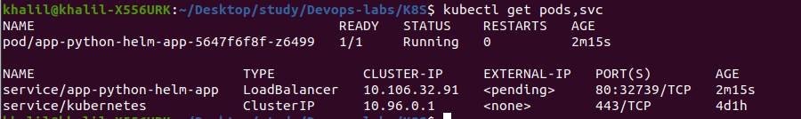
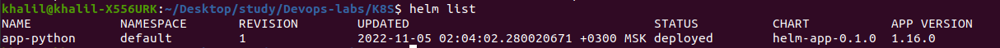
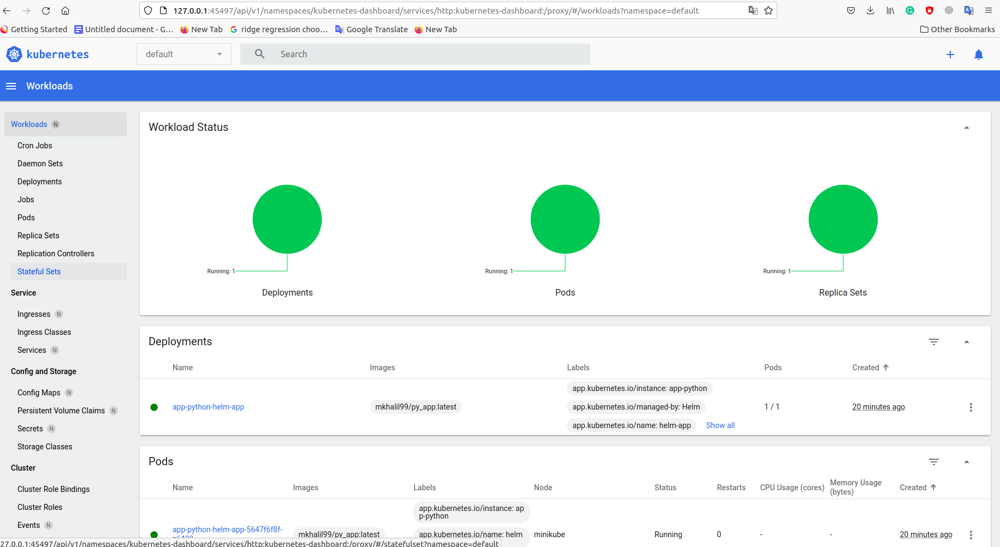
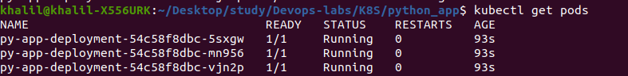
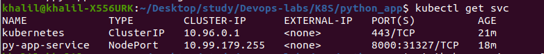
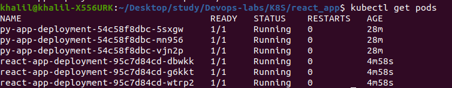
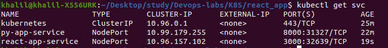
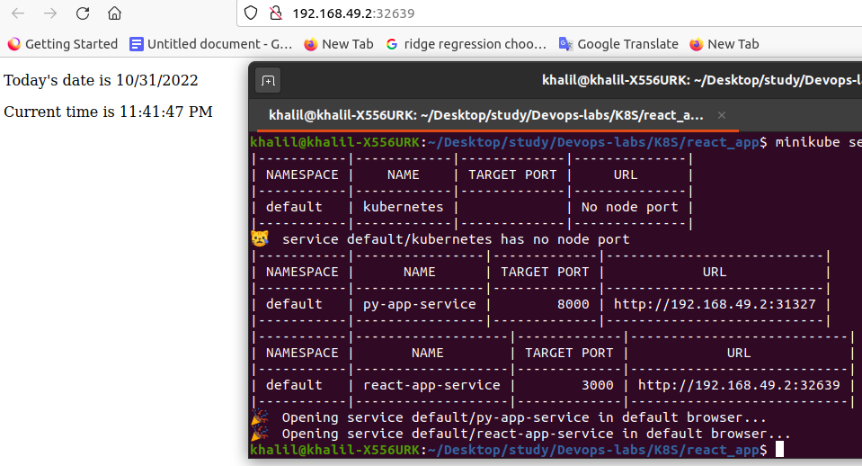

# K8S

# Lab 10

## How to run:

- clone the repo
- move to the right dir by running: ` cd K8S`
- run the following:
```
$ helm package helm-app

$ helm install app-python helm-app-0.1.0.tgz -f helm-app/values.yaml

```

## Helm output:

` kubectl get pods,svc`




` helm list `



### Workloads page in minikube Dashboard




# Lab 9


In this lab, we are using Kubernetes for deploying locally our project!


## How to run:

- clone the repo
- move to the right dir by running: ` cd K8S\python_app`
- run the following:
```
$ kubectl apply -f deployment.yml

$ kubectl apply -f service.yml

$ minikube service --all
```

## Screenshots of the work

### Manually deploying Python app

The Outputs of running:
` kubectl get pods,svc`


### Deploying Python app with configuration files:

The needed files in python_app dir:

Output of: 
- `kubectl get pods`



- `kubectl get svc`



Output of:
- `minikube service --all`


## Bonus tasks


### Deploying React app with configuration files:

The needed files in react_app dir:

Output of:  

- `kubectl get pods`



- `kubectl get svc`



Output of:
- `minikube service --all`




## Explanation of other configuration files

- Ingress: Responsible about following rules for handling request, such as HTTP requests, from external to internal services.

- Ingress controller: responsible of taking Ingress resources and setting a proxy.

- StatefulSet: Object responsible about managing pods.

- DaemonSet: Object responsible to make a copy of pods running on specific nodes.

- PersistentVolumes: Object responsible about storage system.

