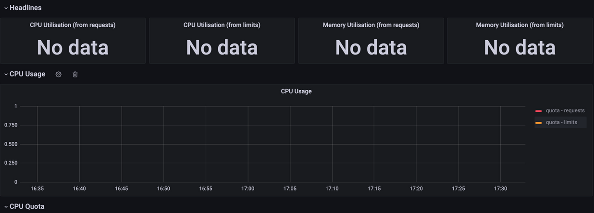
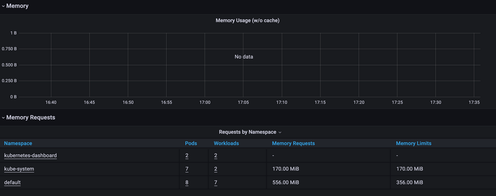
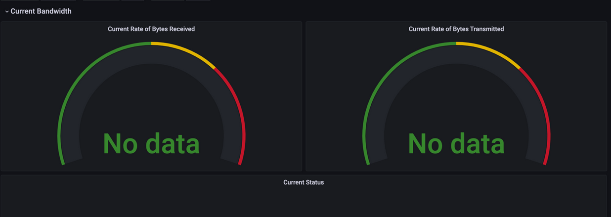

# Prometheus

## Component description

- The Prometheus Operator: responsible about managing all components from prometheus.
- Highly available Prometheus: responsible about system monitoring.
- Highly available Alertmanager: responsible about handling alerts sent by the system.
- Prometheus node-exporter: responsible about getting metrics from OS.
- Prometheus Adapter for K8S Metrics APIs: responsible about K8S metrics.
- kube-state-metrics: responsible about generating metrics from K8S messages.
- Grafana: data monitoring, visualization.

## Outputs:

Output of `kubectl get po,sts,svc,pvc,cm`

```
khalil@khalil-X556URK:~/Desktop/study/Devops-labs/K8S$ kubectl get po,sts,svc,pvc,cm
NAME                                                         READY   STATUS    RESTARTS        AGE
pod/alertmanager-prometheus-kube-prometheus-alertmanager-0   2/2     Running   1 (4m41s ago)   5m4s
pod/prometheus-grafana-5d9f5d6499-kgqx5                      3/3     Running   0               5m18s
pod/prometheus-kube-prometheus-operator-79dd9d7c5f-q2mqx     1/1     Running   0               5m18s
pod/prometheus-kube-state-metrics-6cfd96f4c8-b8ld8           1/1     Running   0               5m18s
pod/prometheus-prometheus-kube-prometheus-prometheus-0       2/2     Running   0               5m3s
pod/prometheus-prometheus-node-exporter-fwrx7                1/1     Running   0               5m18s
pod/helm-app-0                                               1/1     Running   126 (42s ago)   7d7h
pod/helm-app-1                                               1/1     Running   100 (42s ago)   7d7h

NAME                                                                    READY   AGE
statefulset.apps/alertmanager-prometheus-kube-prometheus-alertmanager   1/1     5m4s
statefulset.apps/prometheus-prometheus-kube-prometheus-prometheus       1/1     5m4s
statefulset.apps/helm-app                                               2/2     7d2h

NAME                                              TYPE        CLUSTER-IP       EXTERNAL-IP   PORT(S)                      AGE
service/alertmanager-operated                     ClusterIP   None             <none>        9093/TCP,9094/TCP,9094/UDP   5m4s
service/kubernetes                                ClusterIP   10.96.0.1        <none>        443/TCP                      7d2h
service/prometheus-grafana                        ClusterIP   10.105.166.51    <none>        80/TCP                       5m18s
service/prometheus-kube-prometheus-alertmanager   ClusterIP   10.96.203.37     <none>        9093/TCP                     5m18s
service/prometheus-kube-prometheus-operator       ClusterIP   10.96.44.183     <none>        443/TCP                      5m18s
service/prometheus-kube-prometheus-prometheus     ClusterIP   10.104.164.97    <none>        9090/TCP                     5m18s
service/prometheus-kube-state-metrics             ClusterIP   10.107.122.228   <none>        8080/TCP                     5m18s
service/prometheus-operated                       ClusterIP   None             <none>        9090/TCP                     5m4s
service/prometheus-prometheus-node-exporter       ClusterIP   10.111.13.244    <none>        9100/TCP                     5m18s
service/helm-app                                  ClusterIP   10.98.144.28     <none>        80/TCP                       7d2h

NAME                                                                   STATUS   VOLUME                                     CAPACITY   ACCESS MODES   STORAGECLASS   AGE
persistentvolumeclaim/persistence-volume-helm-app-0                    Bound    pvc-62800c18-d0d7-4064-8727-b48f32199791   512Mi      RWO            standard       7d3h
persistentvolumeclaim/persistence-volume-helm-app-1                    Bound    pvc-13068d7b-7aa6-4def-830d-94b8d2ab9d1f   512Mi      RWO            standard       7d3h

NAME                                                                     DATA   AGE
configmap/kube-root-ca.crt                                               1      36d
configmap/prometheus-grafana                                             1      5m19s
configmap/prometheus-grafana-config-dashboards                           1      5m19s
configmap/prometheus-kube-prometheus-alertmanager-overview               1      5m19s
configmap/prometheus-kube-prometheus-apiserver                           1      5m19s
configmap/prometheus-kube-prometheus-cluster-total                       1      5m19s
configmap/prometheus-kube-prometheus-controller-manager                  1      5m19s
configmap/prometheus-kube-prometheus-etcd                                1      5m19s
configmap/prometheus-kube-prometheus-grafana-datasource                  1      5m19s
configmap/prometheus-kube-prometheus-grafana-overview                    1      5m19s
configmap/prometheus-kube-prometheus-k8s-coredns                         1      5m19s
configmap/prometheus-kube-prometheus-k8s-resources-cluster               1      5m19s
configmap/prometheus-kube-prometheus-k8s-resources-namespace             1      5m19s
configmap/prometheus-kube-prometheus-k8s-resources-node                  1      5m19s
configmap/prometheus-kube-prometheus-k8s-resources-pod                   1      5m19s
configmap/prometheus-kube-prometheus-k8s-resources-workload              1      5m19s
configmap/prometheus-kube-prometheus-k8s-resources-workloads-namespace   1      5m19s
configmap/prometheus-kube-prometheus-kubelet                             1      5m19s
configmap/prometheus-kube-prometheus-namespace-by-pod                    1      5m19s
configmap/prometheus-kube-prometheus-namespace-by-workload               1      5m18s
configmap/prometheus-kube-prometheus-node-cluster-rsrc-use               1      5m19s
configmap/prometheus-kube-prometheus-node-rsrc-use                       1      5m18s
configmap/prometheus-kube-prometheus-nodes                               1      5m18s
configmap/prometheus-kube-prometheus-nodes-darwin                        1      5m19s
configmap/prometheus-kube-prometheus-persistentvolumesusage              1      5m19s
configmap/prometheus-kube-prometheus-pod-total                           1      5m19s
configmap/prometheus-kube-prometheus-prometheus                          1      5m19s
configmap/prometheus-kube-prometheus-proxy                               1      5m18s
configmap/prometheus-kube-prometheus-scheduler                           1      5m19s
configmap/prometheus-kube-prometheus-workload-total                      1      5m19s
configmap/prometheus-prometheus-kube-prometheus-prometheus-rulefiles-0   29     5m4s
configmap/helm-app-configmap                                             1      7d2h

```

## Monitoring Grafana

so baisically I got the issue of "No data", here is CPU nad Memory consuming:



Memory usage:




Current bandwith:



## Init container:

Added `init-container.yaml` and applied `kubectl apply -f init-container.yaml` :

```
khalil@khalil-X556URK:~/Desktop/study/Devops-labs/K8S$ kubectl exec pod/init-demo -- cat /usr/share/nginx/html/index.html
Defaulted container "init-container-application" out of: init-container-application, install (init)
<html><head></head><body><header>
<title>http://info.cern.ch</title>
</header>

<h1>http://info.cern.ch - home of the first website</h1>
<p>From here you can:</p>
<ul>
<li><a href="http://info.cern.ch/hypertext/WWW/TheProject.html">Browse the first website</a></li>
<li><a href="http://line-mode.cern.ch/www/hypertext/WWW/TheProject.html">Browse the first website using the line-mode browser simulator</a></li>
<li><a href="http://home.web.cern.ch/topics/birth-web">Learn about the birth of the web</a></li>
<li><a href="http://home.web.cern.ch/about">Learn about CERN, the physics laboratory where the web was born</a></li>
</ul>
</body></html>

```
