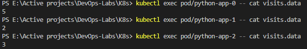

# K8s StatefulSet

## Running `kubectl get po,sts,svc,pvc`

## Getting visits from all replicas

## Difference between the output of the command for replicas explaination

Each replica has a different independent volume, and since the state of the volume is defined by the file `visits.data` therefore each replica will have a different `visits.data` which makes them have different states.

## Ordering explaination and solution

Since each replica has different and independent states, the order in which each replica starts is irrelevent.

Pods can be set to start in parallel by setting `podManagementPolicy` to `parallel` in the statefulset.
