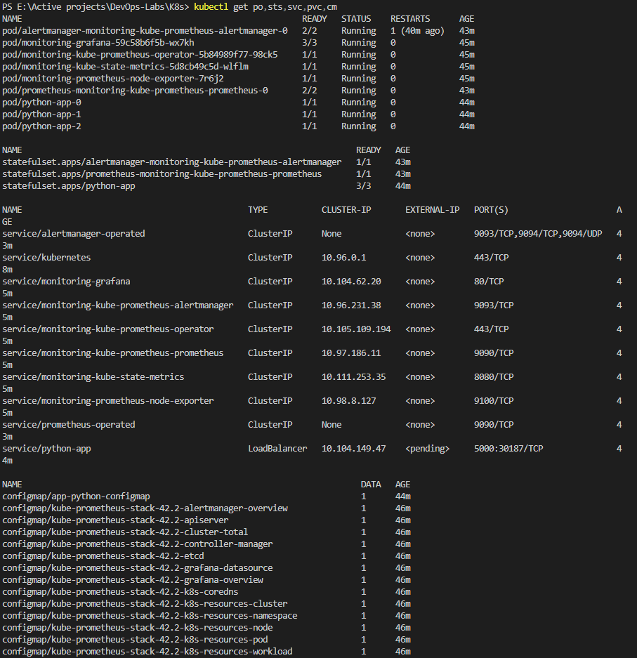
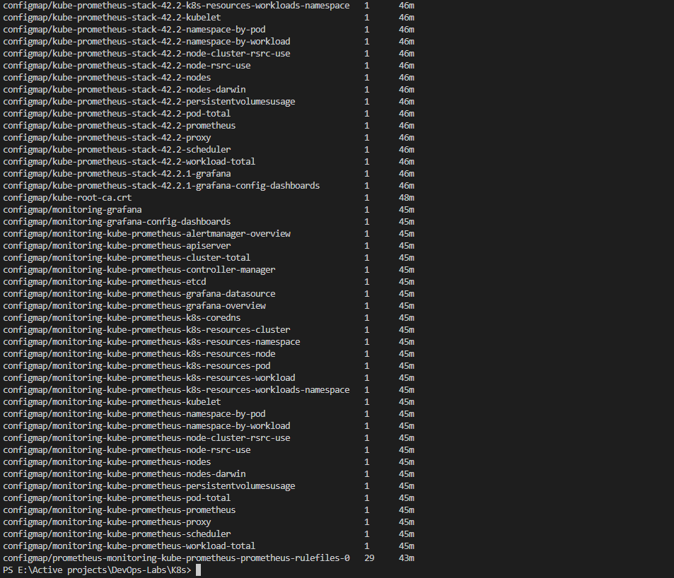

# K8s monitoring

## kube-prometheus stack components

### Prometheus Operator

Used to easily integerate prometheus with Kubernetes.

### Prometheus

Used to collect metrics from applications and store them in a time series database.

### Alertmanager

Handles and processes alerts created by applications and forwarding them.

### Prometheus node-exporter

Used to export hardware and OS metrics provided by the kernel of it's node.

### Prometheus Adapter for Kubernetes Metrics APIs

Connects between Kubernetes and Prometheus by getting Kubernetes metrics using its API and adapting it to Prometheus.

### kube-state-metrics

Exports Kubernetes metrics using its API. It outputs the raw data without modification.

### Grafana

A dashboard application to view and manage(sort, filter, etc) metrics collected from different sources.

## Running `kubectl get po,sts,svc,pvc,cm`

