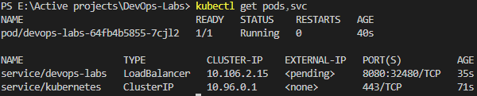
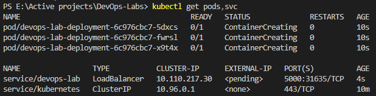
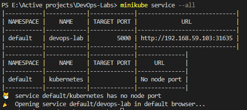
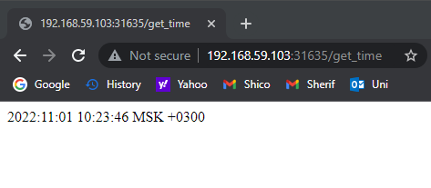
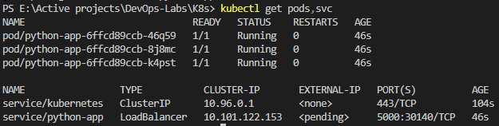

# Kubernetes

## Before using config files

### Running `kubectl get pods,svc`

## After using config files

### Running `kubectl get pods,svc`

### Running `minikube service --all`

### Screenshot from browser

## Helm

### Running `kubectl get pods,svc`

