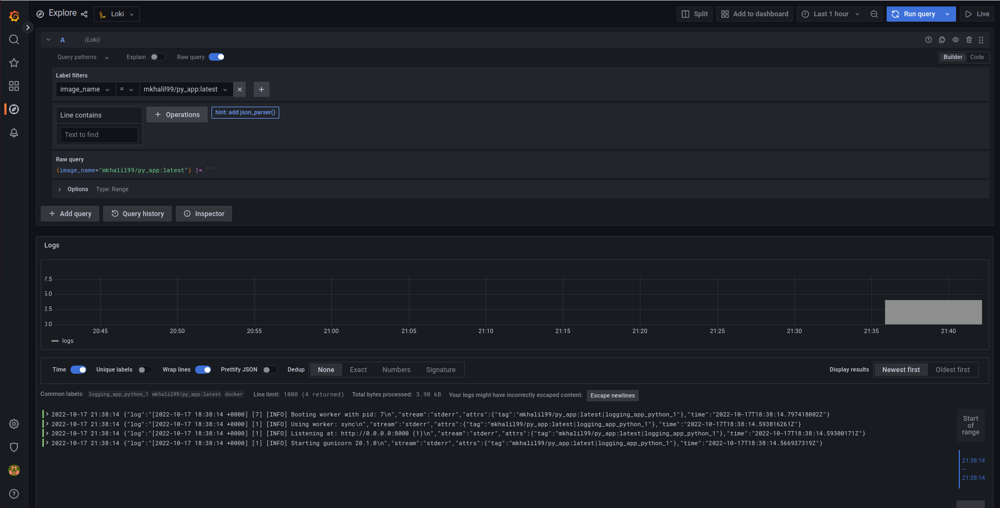
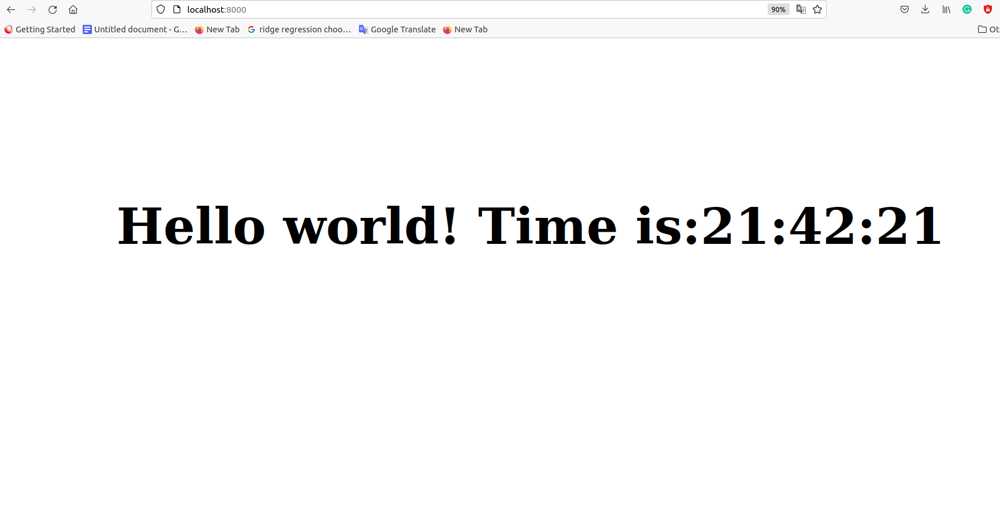
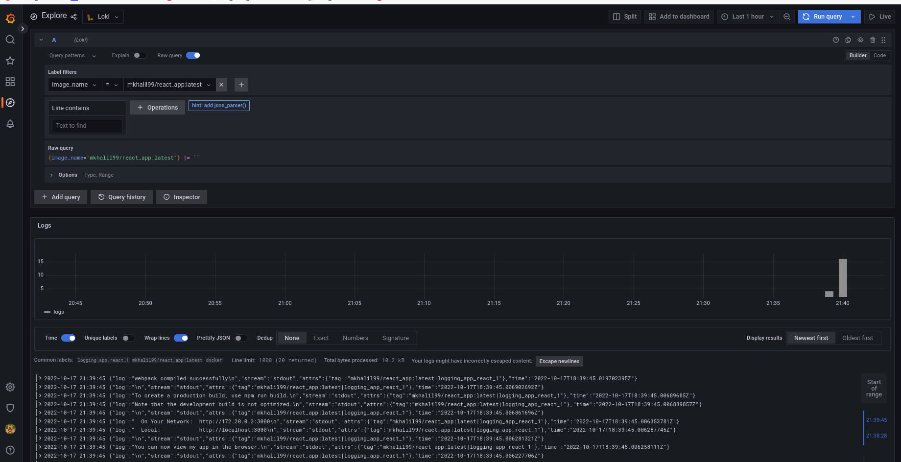

# Monitoring

*Grafana, Loki and Promtail* are used for logging.

## How to run:

- clone the repo
- move to the right dir by running: ``` cd Monitoring```
- run docker-compose by: ```docker-compose up```

## Screenshots of the work

### Monitoring of Python app

You may see logs provided:


and check the application live on [http://localhost:8000](http://localhost:9000)



### Monitoring of React app

You may see logs provided:.

