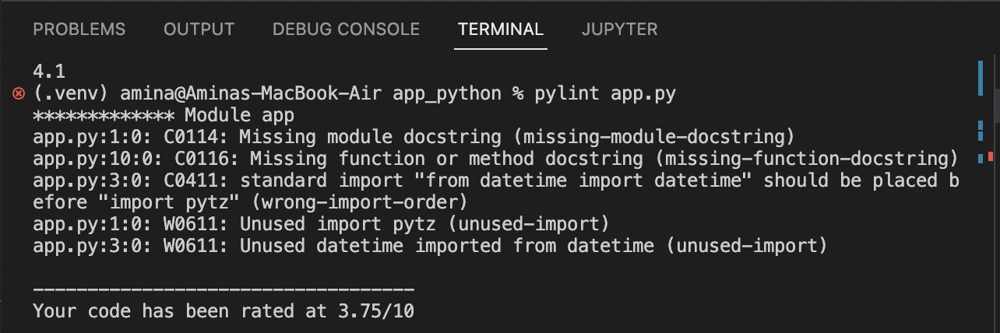
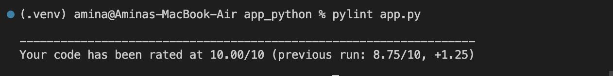
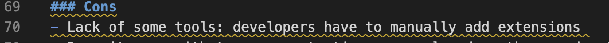

# Time App Development Proccess

The aim of this file is to describe the proccess of development a simple Python web application, that shows current time in Moscow.
While working on the project, I studied what the best practices of Python are and how the use of them will improve my project.
All best practices I have applied are written below along with an explanation of the choice of a framework (I have chosen Flask).

## Python Best Practices I Applied

### Structure of a project

There are key components of the project structure that greatly simplify its usage. Therefore, it's a good practice to spend some time creating these components. They are:

- README.md (provides an introduction to the repository files)
- src folder / actual code file
- requirements.txt (list of modules and dependencies of the project)
- setup.py (prepares for launch and distribute modules needed by the project)
- images folder
- static folder (holds styles)
- templates folder (holds html templates)

### Code style

Following the PEP-8 guideline would also be a good practice.

- Name variables and functions with relevant words, splitting them with '_' if needed:

    `lower_case_with_underscores`

- Comments should be meaningful and reasonable
- Indentation via 4 spaces
- Whitespaces around operators and assignments
- Line length maximum 79 characters
- Imports should always be on top of the file on separate lines
However, it's ok to write this:

    `from flask import Flask, render_template`

- Avoid numerous return statements in function body

### Linters

Linters help to identify mistakes in your code (such as mistyped variable names, unclosed bracket, incorrect tabbing).

### Virtual Environments

This will avoid library clashes and make it easier to work on different projects at the same time.

## Why Did I Choose Flask?

For me, the decisive factor for choosing framework was that I was developing a web application (even such a basic one as given in an assignment) for the first time.
Therefore, it was important for me to find such a framework that would be simple enough to study. Moreover, it should be the popular one, so that I could find a lot of exhaustive tutorials on it.

Since we are speaking about Python, there are three main types of frameworks: Full-Stack, Micro- and Asynchronous frameworks.
My goal was to develop a simple product app with no need to  support a wide range of libraries and databases. Also, my app wasn't supposed to handle a large set of concurrent connections. So,  expressed a preference for the use of micro-framework.

Flask is a Python-based micro framework for developing web applications. It is one of the most popular tools among both beginners and professionals. One can verify this by seeing a huge number of articles about web applications development which recommend to use Flask.

### Pros

- Easy to Use: the framework is straightforward even for a beginner (its documentation is very helpful)
- There are a lot of tutorials
- Easy-to-set-up
- Has a quick debugger
- Flexible: Flask is open to change (comparing to Django)
- Scalable: it enables to run a project smoothly even if it scales up (potentially we will grow our project)
- Supports modular programming

### Cons

- Lack of some tools: developers have to manually add extensions
- Doesn't cope with too many extentions: may slow down the app due to a multitude of requests
- Using more modules could increase the security risk (if a malicious module is included)
- Community support is smaller (comparing with Django)

## Linters That I Used

### The Pylint

While choosing linters for Python, I desided to select the Pylint. It finds some programming and stylistic errors (invalid code constructions) and tries to enforce a coding standard. Moreover, Pylint allows to customize it to our needs (output only the errors that are the most important for us).

I was pleasantly surprised to receive an exhaustive description of all the mistakes made.

So I could easily analyze and correct them:

### markdownlint

As for Markdown, I chose the most appropriate one - the markdownlint. It is an extension for the Visual Studio Code editor, so the installation was very easy for me.
markdownlint includes a library of rules to encourage standards and consistency for Markdown files. Any lines that violate one of markdownlint's rules trigger a Warning in the editor:

## Unit Tests Best Practices I Applied

1. Write Simple Tests (make tests as simple as possible: test as least as possible in one test)
1. Write Deterministic Tests
1. Test One Scenario Per Test (test one particular part in one test)
1. Don't Modify The App Code In Tests
1. Write Isolated Tests
1. Write Readable Tests (make tests as simple as possible: make comments)
1. Use pytest
1. Create The `tests` Folder
1. Name Each Test Starting With `test_`
1. Maximize Test Code Coverage
1. Parametrize The Same Behavior (`pytest.mark.parametrize`)
