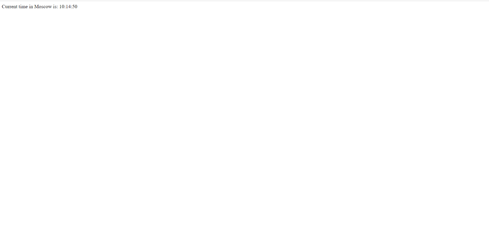

# Date and Time Viewer Web App 
## Student: Bektleuov Talgat, CS-01
# Overview and Usage
This web application shows the current date and time in Moscow. The time updates when a user refreshes the page

# Build
Application was built by Production Ready Web Framework Django

# Run the project
### 1. After downloading the project, enter the project:

`cd DevOpsLabs`
### 2. You can run the project using the command:

`python manage.py runserver`

# Docker
### 1. Run the server in Docker using the command:

`docker-compose up`

### 2. Now you should see the website by going to http://0.0.0.0:8000/

# Docker Containerization

1. I have created an account in Docker Hub account 
2. I built an image for pushing using command: `docker build -t tbektleuov/devopslabs:lab2 .`
3. Then, I run it using: `docker run tbektleuov/devopslabs:lab2`
4. I logged in to docker with my credentials using command: `docker loging`
5. After that, I pushed using the command: `docker push tbektleuov/devopslabs:lab2`

# Contact

### Project link: https://github.com/TalgatBektleuov/DevOpsLabs
### Email: t.bektleuov@innopolis.university

