# Ansible report

Check docker version before run ansible (docker is not installed):

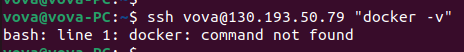

50 last lines of the output of the my deployment command (`ansible-playbook playbooks/dev/main.yml --diff`):

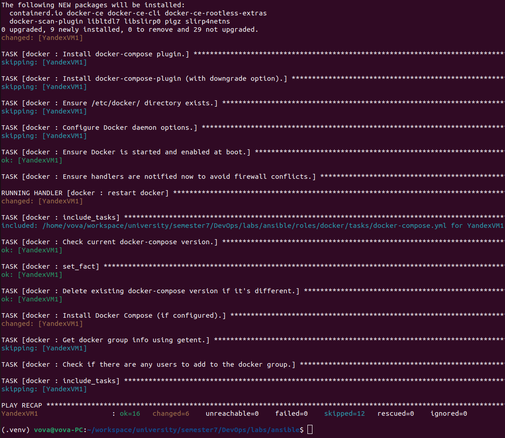

Output of the `ansible-inventory` command:

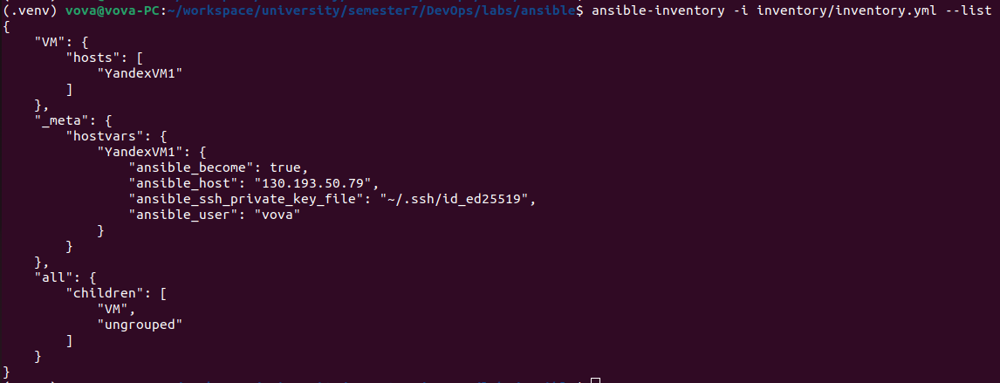

Check docker version after running ansible:

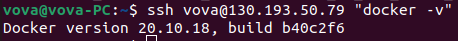

## Bonus task

Recreate Yandex virtual machine.

Check docker version before run ansible (docker is not installed):

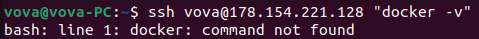

50 last lines of the output of the my deployment command (`ansible-playbook playbooks/dev_with_plugin/main.yml --ask-vault-pass --diff`):

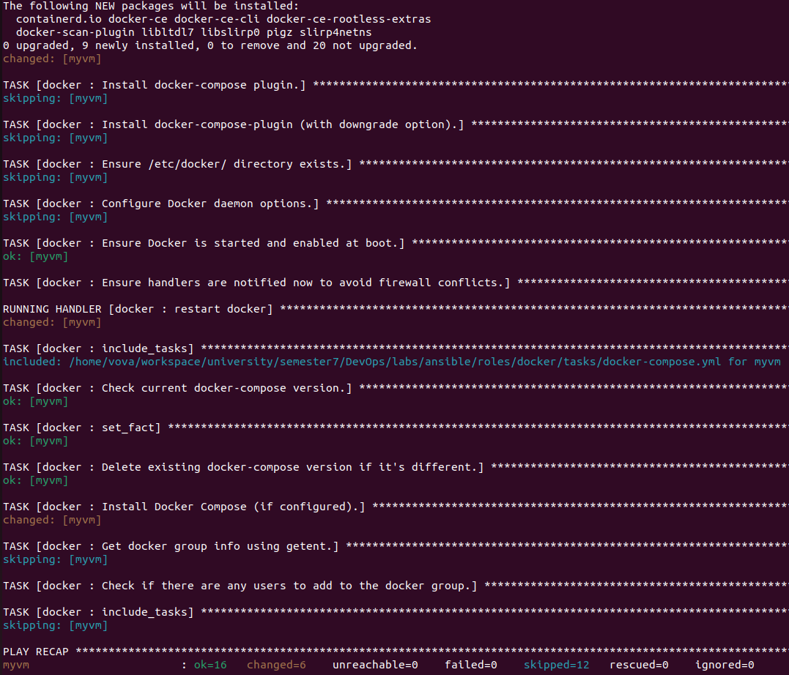

Output of the `ansible-inventory` command:

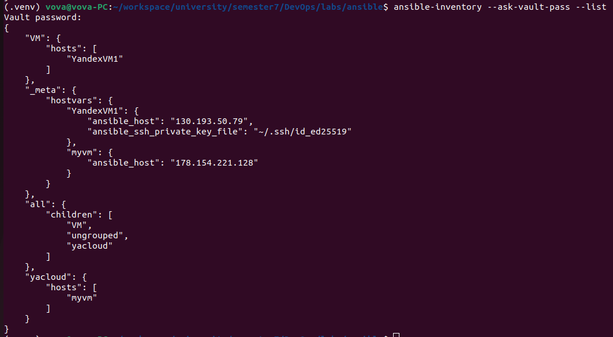

Check docker version after running ansible:

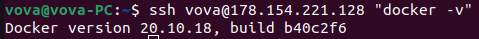

## Lab6

Check the site before running ansible:

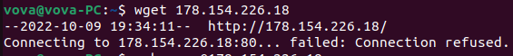

Output of the your deployment command:

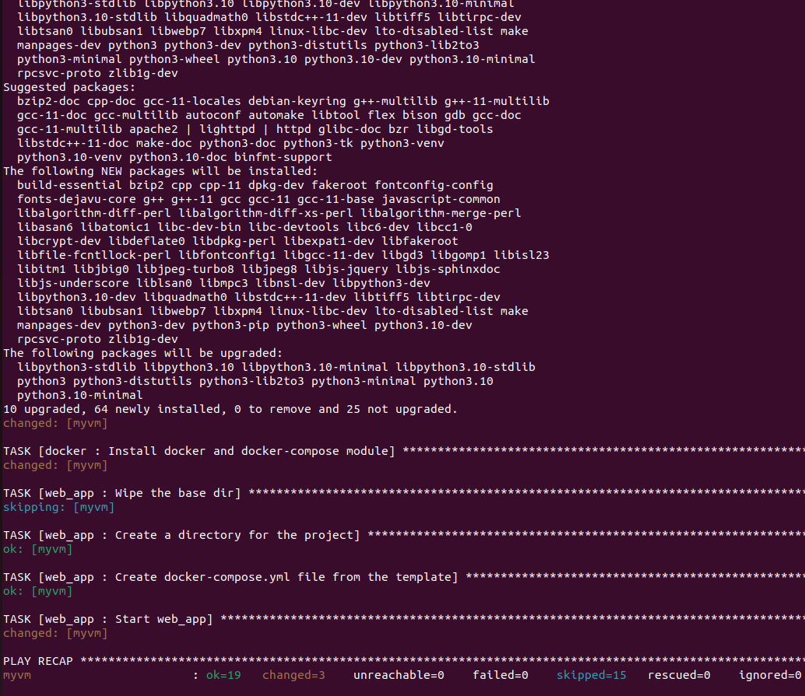

Check the site after running ansible:

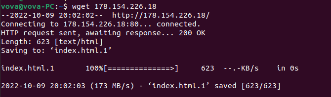