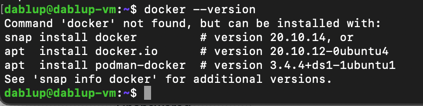
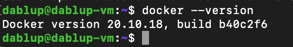

# Ansible 


### Let's check if we have docker inside our VM


### Now let's deploy the role
To do it we use command `ansible-playbook <path_to_playgroud_yml_file> --diff`

### 1) Logs of `ansible-playbook`

```
PLAY [Install docker for yandex cloud machine] *****************************************************************************************************************************

TASK [Gathering Facts] *****************************************************************************************************************************************************
ok: [server]

TASK [docker : Load OS-specific vars.] *************************************************************************************************************************************
ok: [server]

TASK [docker : include_tasks] **********************************************************************************************************************************************
skipping: [server]

TASK [docker : include_tasks] **********************************************************************************************************************************************
included: /Users/daniil/PycharmProjects/devops_labs/ansible/roles/docker/tasks/setup-Debian.yml for server

TASK [docker : Ensure old versions of Docker are not installed.] ***********************************************************************************************************
ok: [server]

TASK [docker : Ensure dependencies are installed.] *************************************************************************************************************************
ok: [server]

TASK [docker : Ensure additional dependencies are installed (on Ubuntu < 20.04 and any other systems).] ********************************************************************
skipping: [server]

TASK [docker : Ensure additional dependencies are installed (on Ubuntu >= 20.04).] *****************************************************************************************
ok: [server]

TASK [docker : Add Docker apt key.] ****************************************************************************************************************************************
ok: [server]

TASK [docker : Ensure curl is present (on older systems without SNI).] *****************************************************************************************************
skipping: [server]

TASK [docker : Add Docker apt key (alternative for older systems without SNI).] ********************************************************************************************
skipping: [server]

TASK [docker : Add Docker repository.] *************************************************************************************************************************************
ok: [server]

TASK [docker : Install Docker packages.] ***********************************************************************************************************************************
skipping: [server]

TASK [docker : Install Docker packages (with downgrade option).] ***********************************************************************************************************
Suggested packages:
  aufs-tools cgroupfs-mount | cgroup-lite
The following NEW packages will be installed:
  docker-ce docker-ce-cli
0 upgraded, 2 newly installed, 0 to remove and 29 not upgraded.
changed: [server]

TASK [docker : Install docker-compose plugin.] *****************************************************************************************************************************
skipping: [server]

TASK [docker : Install docker-compose-plugin (with downgrade option).] *****************************************************************************************************
skipping: [server]

TASK [docker : Ensure /etc/docker/ directory exists.] **********************************************************************************************************************
skipping: [server]

TASK [docker : Configure Docker daemon options.] ***************************************************************************************************************************
skipping: [server]

TASK [docker : Ensure Docker is started and enabled at boot.] **************************************************************************************************************
ok: [server]

TASK [docker : Ensure handlers are notified now to avoid firewall conflicts.] **********************************************************************************************

RUNNING HANDLER [docker : restart docker] **********************************************************************************************************************************
changed: [server]

TASK [docker : include_tasks] **********************************************************************************************************************************************
included: /Users/daniil/PycharmProjects/devops_labs/ansible/roles/docker/tasks/install-compose.yml for server

TASK [docker : Check current docker-compose version.] **********************************************************************************************************************
ok: [server]

TASK [docker : set_fact] ***************************************************************************************************************************************************
ok: [server]

TASK [docker : Delete existing docker-compose version if it's different.] **************************************************************************************************
skipping: [server]

TASK [docker : Install Docker Compose (if configured).] ********************************************************************************************************************
skipping: [server]

TASK [docker : Get docker group info using getent.] ************************************************************************************************************************
skipping: [server]

TASK [docker : Check if there are any users to add to the docker group.] ***************************************************************************************************

TASK [docker : include_tasks] **********************************************************************************************************************************************
skipping: [server]

PLAY RECAP *****************************************************************************************************************************************************************
server                     : ok=14   changed=2    unreachable=0    failed=0    skipped=14   rescued=0    ignored=0   
```

Now let's check that on VM we have docker installed.



### 2) Logs of `ansible-inventory`

```terraform
daniil@Daniils-MacBook-Pro ansible % ansible-inventory default_yandex_cloud.yml --list
{
    "_meta": {
        "hostvars": {
            "server": {
                "ansible_become": true,
                "ansible_host": "51.250.79.211",
                "ansible_ssh_private_key_file": "~/key.pem",
                "ansible_user": "dablup"
            }
        }
    },
    "all": {
        "children": [
            "ungrouped"
        ]
    },
    "ungrouped": {
        "hosts": [
            "server"
        ]
    }
}

```
