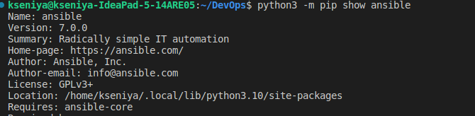

# Ansible

## Install Ansible

Run this command to install the [Ansible](https://docs.ansible.com/ansible/latest/installation_guide/intro_installation.html) package for the current user:

    ```bash
    python3 -m pip install --user ansible
    ```

We can check it by running:

    ```bash
    python3 -m pip show ansible
    ```


## Create an ansible role for docker

1. You can use a [docker role](https://github.com/geerlingguy/ansible-role-docker) from `ansible-galaxy` as template.

    ```bash
    ansible-galaxy install geerlingguy.docker
    ```  
    Sometimes it is installed in some different directory, so we need to move it manually.

1. I have creared a playbook file and provided the full path for the this predefined role in playbooks configuration (just the role by itself resolved in the error of the system not knowing it):

    ```bash
    roles: 
        - /home/kseniya/DevOps/ansible/roles/geerlingguy.docker
    ```

1. Start your VM. I have used Yandex service:
    ```bash
    cd terraform/yandex
    terraform init
    terraform fmt
    terraform validate
    terraform apply
    ```

1. Then I putted VM's information to `ansible/inventory/inventory.yml` file  
1. Run 'ansible-playbook <path_to your_playbook> --diff':

    If you got message like this:

    ```bash
    "E: Failed to fetch http://ru.archive.ubuntu.com/ubuntu/pool/universe/a/apt/apt-transport-https_2.4.7_all.deb  404  Not Found [IP: some_ip]"
    ```

    Connect to your VM via ssh and change mirrors in Ubuntu Server from regional to main:

    ```bash
        sudo nano /etc/apt/sources.list
        ```

    Change all `ru.archive.ubuntu.com/ubuntu` to `http://archive.ubuntu.com/ubuntu`

## Outputs

1. Playbook Run:

   ```sh
    ansible-playbook  /home/kseniya/DevOps/ansible/playbooks/dev/main.yaml -i /home/kseniya/DevOps/ansible/inventory --diff

    PLAY [Install docker] ********************************************************************************************************************************************************************************

    TASK [Gathering Facts] *******************************************************************************************************************************************************************************

    TASK [geerlingguy.docker : Install docker-compose plugin.] ********************************************************************************************
    skipping: [yacloud-vm]

    TASK [geerlingguy.docker : Install docker-compose-plugin (with downgrade option).] ********************************************************************
    skipping: [yacloud-vm]

    TASK [geerlingguy.docker : Ensure /etc/docker/ directory exists.] *************************************************************************************
    skipping: [yacloud-vm]

    TASK [geerlingguy.docker : Configure Docker daemon options.] ******************************************************************************************
    skipping: [yacloud-vm]

    TASK [geerlingguy.docker : Ensure Docker is started and enabled at boot.] *****************************************************************************
    ok: [yacloud-vm]

    TASK [geerlingguy.docker : Ensure handlers are notified now to avoid firewall conflicts.] *************************************************************

    RUNNING HANDLER [geerlingguy.docker : restart docker] *************************************************************************************************
    changed: [yacloud-vm]

    TASK [geerlingguy.docker : include_tasks] *************************************************************************************************************
    included: /Users/kseniya/Desktop/DevOps/ansible/roles/geerlingguy.docker/tasks/docker-compose.yml for yacloud-vm

    TASK [geerlingguy.docker : Check current docker-compose version.] *************************************************************************************
    ok: [yacloud-vm]

    TASK [geerlingguy.docker : set_fact] ******************************************************************************************************************
    ok: [yacloud-vm]

    TASK [geerlingguy.docker : Delete existing docker-compose version if it\'s different.] *****************************************************************
    ok: [yacloud-vm]

    TASK [geerlingguy.docker : Install Docker Compose (if configured).] ***********************************************************************************
    changed: [yacloud-vm]

    TASK [geerlingguy.docker : Get docker group info using getent.] ***************************************************************************************
    skipping: [yacloud-vm]

    TASK [geerlingguy.docker : Check if there are any users to add to the docker group.] ******************************************************************

    TASK [geerlingguy.docker : include_tasks] *************************************************************************************************************
    skipping: [yacloud-vm]

    PLAY RECAP ********************************************************************************************************************************************
    yacloud-vm                 : ok=16   changed=5    unreachable=0    failed=0    skipped=12   rescued=0    ignored=0


   ```

1. Output of 'ansible-inventory -i <name_of_your_inventory_file>.yaml --list':

   ```sh
    {
        "_meta": {
            "hostvars": {
                "yacloud-vm": {
                    "ansible_become": true,
                    "ansible_host": "62.84.112.117",
                    "ansible_user": "ubuntu"
                    
                }
            }
        },
        "all": {
            "children": [
                "ungrouped",
                "vms"
            ]
        },
        "vms": {
            "hosts": [
                "yacloud-vm"
            ]
        }
    }
   ```

## Yandex Cloud

1. [Set up dynamic inventory](https://github.com/rodion-goritskov/yacloud_compute) for the cloud by adding 'yacloud_compute.py' file to plugins using this 
