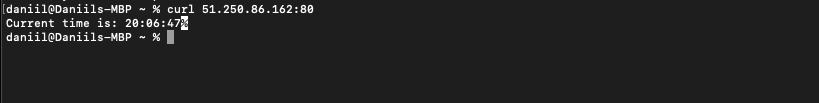

# Ansible

### Logs of deployment of new role (Playbook `python_app.yaml`)
```
daniil@Daniils-MBP ansible %    ansible-playbook playbooks/dev/python_app.yaml

PLAY [Deploy application for yandex cloud machine] *************************************************************************************************************************************************************************************

TASK [Gathering Facts] *****************************************************************************************************************************************************************************************************************
ok: [server]

TASK [web_app : Create a directory of application] *************************************************************************************************************************************************************************************
ok: [server]

TASK [web_app : Docker compose file creation] ******************************************************************************************************************************************************************************************
ok: [server]

TASK [web_app : Run all services] ******************************************************************************************************************************************************************************************************
changed: [server]

PLAY RECAP *****************************************************************************************************************************************************************************************************************************
server                     : ok=4    changed=1    unreachable=0    failed=0    skipped=0    rescued=0    ignored=0
```
Check that everythnig works fine


### Logs of deployment with wipes and dependencies
```
daniil@Daniils-MBP ansible %    ansible-playbook playbooks/dev/python_app.yaml

PLAY [Deploy application for yandex cloud machine] *************************************************************************************************************************************************************************************

TASK [Gathering Facts] *****************************************************************************************************************************************************************************************************************
ok: [server]

TASK [docker : Load OS-specific vars.] *************************************************************************************************************************************************************************************************
ok: [server]

TASK [docker : include_tasks] **********************************************************************************************************************************************************************************************************
skipping: [server]

TASK [docker : include_tasks] **********************************************************************************************************************************************************************************************************
included: /Users/daniil/PycharmProjects/devops_labs/ansible/roles/docker/tasks/setup-Debian.yml for server

TASK [docker : Ensure old versions of Docker are not installed.] ***********************************************************************************************************************************************************************
ok: [server]

TASK [docker : Ensure dependencies are installed.] *************************************************************************************************************************************************************************************
ok: [server]

TASK [docker : Ensure additional dependencies are installed (on Ubuntu < 20.04 and any other systems).] ********************************************************************************************************************************
skipping: [server]

TASK [docker : Ensure additional dependencies are installed (on Ubuntu >= 20.04).] *****************************************************************************************************************************************************
ok: [server]

TASK [docker : Add Docker apt key.] ****************************************************************************************************************************************************************************************************
ok: [server]

TASK [docker : Ensure curl is present (on older systems without SNI).] *****************************************************************************************************************************************************************
skipping: [server]

TASK [docker : Add Docker apt key (alternative for older systems without SNI).] ********************************************************************************************************************************************************
skipping: [server]

TASK [docker : Add Docker repository.] *************************************************************************************************************************************************************************************************
ok: [server]

TASK [docker : Install Docker packages.] ***********************************************************************************************************************************************************************************************
skipping: [server]

TASK [docker : Install Docker packages (with downgrade option).] ***********************************************************************************************************************************************************************
ok: [server]

TASK [docker : Install docker-compose plugin.] *****************************************************************************************************************************************************************************************
skipping: [server]

TASK [docker : Install docker-compose-plugin (with downgrade option).] *****************************************************************************************************************************************************************
skipping: [server]

TASK [docker : Ensure /etc/docker/ directory exists.] **********************************************************************************************************************************************************************************
skipping: [server]

TASK [docker : Configure Docker daemon options.] ***************************************************************************************************************************************************************************************
skipping: [server]

TASK [docker : Ensure Docker is started and enabled at boot.] **************************************************************************************************************************************************************************
ok: [server]

TASK [docker : Ensure handlers are notified now to avoid firewall conflicts.] **********************************************************************************************************************************************************

TASK [docker : include_tasks] **********************************************************************************************************************************************************************************************************
included: /Users/daniil/PycharmProjects/devops_labs/ansible/roles/docker/tasks/install-compose.yml for server

TASK [docker : Check current docker-compose version.] **********************************************************************************************************************************************************************************
ok: [server]

TASK [docker : set_fact] ***************************************************************************************************************************************************************************************************************
ok: [server]

TASK [docker : Delete existing docker-compose version if it's different.] **************************************************************************************************************************************************************
skipping: [server]

TASK [docker : Install Docker Compose (if configured).] ********************************************************************************************************************************************************************************
skipping: [server]

TASK [docker : Get docker group info using getent.] ************************************************************************************************************************************************************************************
skipping: [server]

TASK [docker : Check if there are any users to add to the docker group.] ***************************************************************************************************************************************************************

TASK [docker : include_tasks] **********************************************************************************************************************************************************************************************************
skipping: [server]

TASK [docker : include_tasks] **********************************************************************************************************************************************************************************************************
included: /Users/daniil/PycharmProjects/devops_labs/ansible/roles/docker/tasks/docker-python.yml for server

TASK [docker : Check that Pip is installed.] *******************************************************************************************************************************************************************************************
ok: [server]

TASK [docker : Install docker libraries] ***********************************************************************************************************************************************************************************************
ok: [server]

TASK [web_app : Include wipe if needed] ************************************************************************************************************************************************************************************************
included: /Users/daniil/PycharmProjects/devops_labs/ansible/roles/web_app/tasks/wipe.yml for server

TASK [web_app : Wipe docker compose services] ******************************************************************************************************************************************************************************************
changed: [server]

TASK [web_app : Wipe a base path] ******************************************************************************************************************************************************************************************************
changed: [server]

TASK [web_app : Create a directory of application] *************************************************************************************************************************************************************************************
changed: [server]

TASK [web_app : Docker compose file creation] ******************************************************************************************************************************************************************************************
changed: [server]

TASK [web_app : Run all services] ******************************************************************************************************************************************************************************************************
changed: [server]

PLAY RECAP *****************************************************************************************************************************************************************************************************************************
server                     : ok=22   changed=5    unreachable=0    failed=0    skipped=14   rescued=0    ignored=0   
```

And let's check again that everything works fine

