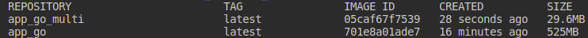

# Work with Docker

## Best practices applied

Best practices were retrieved from <https://sysdig.com/blog/dockerfile-best-practices/>

1. Use the minimal required base container
2. Use trusted base images - official image of GO on DockerHub
3. COPY instead of ADD
4. Place the commands that are less likely to change, and easier to cache, first
5. Linting - hadolint
6. Run as non root
7. Multistage build

Comparison of Multistage build with original one(from 525MB to 29.6MB):

## Linter for Dockerfile

In the project [Hadolint](https://github.com/hadolint/hadolint) linter was used.

`` $ docker run --rm -i hadolint/hadolint < Dockerfile ``
