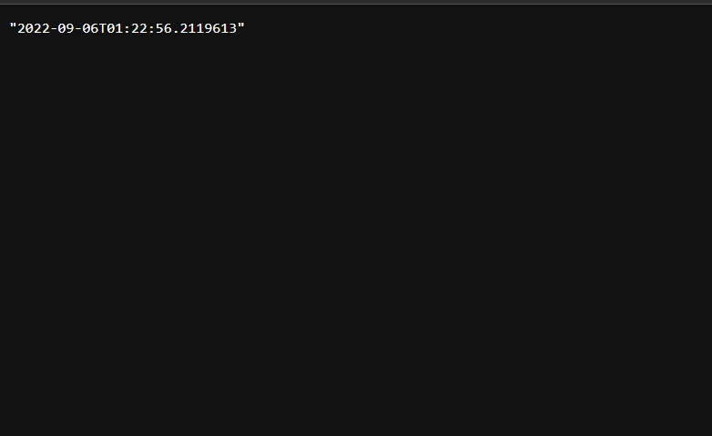

# Timeapp project on Spring

This app will help you to get current time in Europe/Moscow timezone in your browser.

## Overview of technology stack
This project is written using Spring framework. Maven is used to build the project and Java 17 as JDK.

## Docker
Link to the [image on docker hub](https://hub.docker.com/repository/docker/mcflydesigner/spring-ui-lab)

The build is multistage and described in `./Dockerfile`.

### How to run?
* Pull the image from docker hub
```shell
docker pull mcflydesigner/spring-ui-lab:latest
```
* Run the image binding your port 8080 to container's port 8080(application will be listening this port).
```shell
docker run -p 8080:8080 mcflydesigner/spring-ui-lab:latest
```
If everything is great, you will see the following message in your console:

To see the webpage, open the following [link in your browser](http://localhost:8080/time/now).


## How to run?
* You should have pre-installed JDK(Java 17) and Maven 3.8.6.
* Navigate to working dir ```/app_java```
* Run unit tests
```shell
mvn test
```
* Build application as ```.jar```
```shell
mvn clean install
```
* Run app using already built ```.jar``` file
```shell
java -jar ./target/timeapp-0.0.1-SNAPSHOT.jar
```

* The server will be started by default on port 8080. Open the following [link in your browser](http://localhost:8080/time/now).
If everything is correct, you will see the web page similar to the following one:

* Great! Everything works!

## Monitoring

Monitoring is performed with the use of Prometheus.

URL: /actuator/prometheus

Healthcheck URL: /healthcheck

## How to use?
After running the project, open the following [link in your browser](http://localhost:8080/time/now).

## Contribution
You can contribute to our project - we are glad to new ideas. Just open pull requests.

## Credits
This project is developed by [@mcflydesigner, backend dev, devops](https://github.com/mcflydesigner) 

## License
The project is released and distributed under [MIT License](https://en.wikipedia.org/wiki/MIT_License).