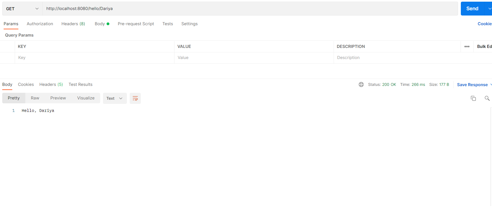

# MoscowTimeDisplayer

## :bulb: Overview

GreetingsApp is simple web-application, which greets people in the format `Hello, name`

## :rocket: Technological stack

- Spring Boot
- Java 8

## How to use:

Run the application, make get request in the form of `http://host:8080/hello/name`

## :pencil: Contacts

Dariya Vakhitova, project creator : d.vakhitova@innopolis.university

## :tada: Illustrations

