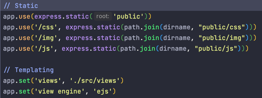
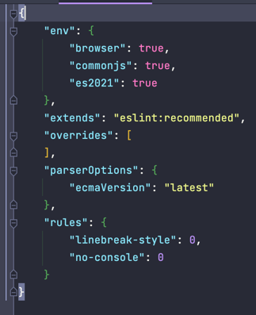
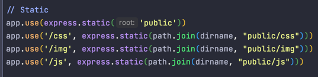

## Best practices applied:

1. Linter (EsLint), [Markdown linter](https://prettier.io/docs/en/install.html). Automatic fixes on file save.
2. Project structure (decoupling, layering, reusing, separation of concerns): 
3. Docstrings for modules
4. Docstrings for methods
5. Sections to separate concerns in one file: 
6. Following recommended eslint guidelines, tuning my linting rules: 
7. Templating using EJS instead of sending raw html
8. I set up static folder for static pages (even though I don't need it just yet): 
9. Routing is divided into several modules (there's currently just one). This is done to scale it later.
   If & when I want to have more than one feature, I can.
10. Virtual Environment not to interfere with my global packages on my OS.
11. Dev mode (npm run dev) while developing. Dev mode in NodeJS is implemented using nodemon extension, for example.
    It watches and restarts server on file changes, also does not allow to restart server until you fix the issue.
12. SOLID, DRY, KISS (ideally)

Fine project architecture I found on the internet:
https://github.com/RaddyTheBrand/Node.js-News-Website/tree/master/public/css

Otherwise, if I decide not to include something in this,
it probably coincides with what I did for Flask or I just forgot to put it here :)

## Why Express?

### Based on my research:

- Express is the de facto standard JavaScript Server Side framework.
- Express is very popular so great community support
- Express is the complete Application framework with, e.g., middleware, routing, template.
- Express supports MVC pattern with View system supporting 14+ templating engines.
- Express also offers robust routing.

## Express pros:

1. Scalability
2. Shallow learning curve
3. Flexibility
4. Simple
5. Support for middleware
6. Documentation
7. Minimalist/Modularity

## Express cons:

1. Not opinionated: It does not enforce to write in any way. So a lot of freedom makes it programmer's
   responsibility to know how to write good code. Also, it may cause you to think of your own frame of work which is
   additional non-transferable knowledge (when you change jobs for example it may not be applicable at the new job)
2. Not security oriented: Again, responsibility for security is up to the programmer to implement and care for.
3. Not the greatest error messages: From one of the Express programmers:
`I've run into situations before where debugging has meant that
I've needed to place console logs at various different levels
of my routing hierarchy to find the source of bugs. This ties
in somewhat to Express being unopinionated. If you're experiencing
hard to debug issues, well that's not the concern of Express..`

## Sources:

- https://javascript.plainenglish.io/top-10-javascript-frameworks-for-server-side-development-in-2020-6d265016c02
- https://www.quora.com/What-are-the-pros-and-cons-of-learning-ExpressJS
