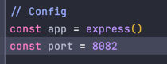

# What Time Is It In Moscow? (WTIIIM?)

## Overview

    Have you ever thought to yourself: "Man, only if I knew what time it is right now"?

    Well, now you can!
    Just visit our amazing cutting-edge web-site. 
    With this application you will always know what time it is!

    Built by time watchers for time watchers!

    P. S. This is an MVP, so you can only watch MSK time at the moment.

### Stack:

- JavaScript
- NodeJS
- Express

## Build

### Prerequisites:

- [NodeJS](https://nodejs.org/es/download/)
- clone this repo

### To run the server:

- `npm i`
- `npm run dev` (To run server in development mode)
- `npm run start` (To run server in production mode)

## Usage

Once you've started the server

To see the web page, navigate to http://localhost:8082 in your browser

If you want to change the address, you can do it in `app.js` in the `Config` section:

## Docker

I containerized this application and uploaded the final image to the docker hub.

The application runs on port 8082 (by default), so you should forward this port when running.

I've looked at multi-staging and believe it's unnecessary for a project this size.

### Prerequisites:

1. [Download docker](https://docs.docker.com/engine/install/)
2. Install it

### Build from local image:

`cd app_javascript/`

`docker build -t wtiiim_app_js .`

`docker run -p 8082:8082 -d wtiiim_app_js`

### Build from docker hub:

`docker pull aladdinych/devops_labs_js`

`docker run -p 8082:8082 -d aladdinych/devops_labs_js`

## Contact

This application has been written and is being maintained by [@al1ych](https://github.com/al1ych)
for educational purposes only.

Contact me on Telegram: [@aladdinych](https://t.me/aladdinych)

## Contribution

### Rules:

### Other rules:

I base my rules on [these](https://github.com/github/docs/blob/main/CONTRIBUTING.md)

#### Create a new issue

If you spot a problem with the docs, search if an issue already exists. If a related issue doesn't exist, you can open a
new issue using a relevant issue form.

#### Solve an issue

Scan through our existing issues to find one that interests you.
You can narrow down the search using labels as filters.
See Labels for more information. As a general rule,
we don’t assign issues to anyone. If you find an issue to work on,
you are welcome to open a PR with a fix.

#### Make Changes

Click Make a contribution at the bottom of any docs page to make small changes such as a typo,
sentence fix, or a broken link.
This takes you to the .md file where you can
make your changes and create a pull request for a review.

- Fork the repository.
- Make your changes without affecting the original project until you're ready to merge them.
- Create a working branch and start with your changes!
- Commit your update
- Commit the changes once you are happy with them.
- Once your changes are ready, don't forget to self-review to speed up the review process.
- Don't forget to link PR to issue if you are solving one.
- Enable the checkbox to allow maintainer edits so the branch can be updated for a merge.
  Once you submit your PR, a team member will review your proposal. We may ask questions or request for additional
  information.
- We may ask for changes to be made before a PR can be merged, either using suggested changes or pull request comments.
- You can apply suggested changes directly through the UI. You can make any other changes in your fork, then commit them
  to your branch.
- As you update your PR and apply changes, mark each conversation as resolved.
- If you run into any merge issues, checkout this git tutorial to help you resolve merge conflicts and other issues.
- Your PR is merged!

Once your PR is merged, your contributions will be publicly visible on the GitHubs docs.
