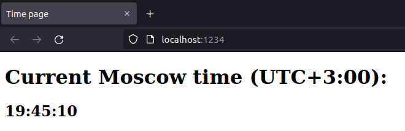

# PureScript time app

## Overview

When a `parcel` dev server starts, one can open a given address in a browser to see current time in Moscow (MSK). The page will automatically refresh each 0.8 seconds.

## Best practices

What I did

- Automatically generated the project via [spago](https://github.com/purescript/spago), an official `PureScript` package manager

- Used linters and formatters (available in VSCodium)

- Adapted An HTML [template](https://www.freecodecamp.org/news/html-starter-template-a-basic-html5-boilerplate-for-index-html/). There is an explanation of why specific tags vere included.

## Chosen framework

[Halogen](https://github.com/purescript-halogen/purescript-halogen)

### Pros

- Type-safe -> Fewer bugs
- Declarative
- Component Architecture
- Fast to code
- Written entirely in PureScript
- Robust

### Cons

- Not easy to learn by following the [guide](https://purescript-halogen.github.io/purescript-halogen/index.html)
- Maintained by only a few persons -> uses some old vulnerable Node packages

## Linters, checkers, formatters

### PureScript

- [purs-tidy](https://github.com/natefaubion/purescript-tidy) - a formatter
- [purescript](https://github.com/purescript/purescript) - `PureScript` compiler. No need for linter as it's a strongly statically typed language

### Markdown

- [markdownlint](https://github.com/DavidAnson/markdownlint) - a linter and formatter

### HTML

- [djlint](https://www.djlint.com/) - an `HTML` linter and formatter

### Dockerfile

See this [section](../README.md#docker)

## Unit tests

As `PureScript` compiles to `JavaScript` and runs in a browser, I used [pytest](https://docs.pytest.org/en/7.1.x/), [selenium](https://www.selenium.dev/), [pytest-selenium](https://pytest-selenium.readthedocs.io/en/latest/user_guide.html#capabilities-fixtures), [geckodriver](https://github.com/mozilla/geckodriver), and [Firefox](https://www.mozilla.org/ru/firefox/) in `headless` mode. Next, I made a unit test that checks via [bs4](https://pypi.org/project/beautifulsoup4/) if a word is present on a page sent by the server.
