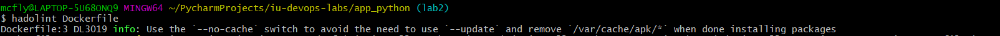

# Describing of the use of Docker

## Best practices applied

* The use of multistage build
* The use of command COPY over ADD
* Base image is trusted. [Official Python base image on docker hub](https://hub.docker.com/_/python)
* Base image is alpine
* Resulting image has small size around 100MB (multi-stage build + base alpine image)
* Rootless container (added custom user and changed owner of app files)
* Only one port is exposed for app
* Credentials and confidentiality are not stored in the resulting image
* Use of `.dockerignore` file to remove unnecessary files from resulting image


## Linter for Dockerfile

In this project I used [hadolint linter](https://github.com/hadolint/hadolint).

### How to run linter?
* Navigate to `./app_python`
```shell
cd ./app_python
```
* Run linter
```shell
hadolint Dockerfile
```

*Example of run*:
