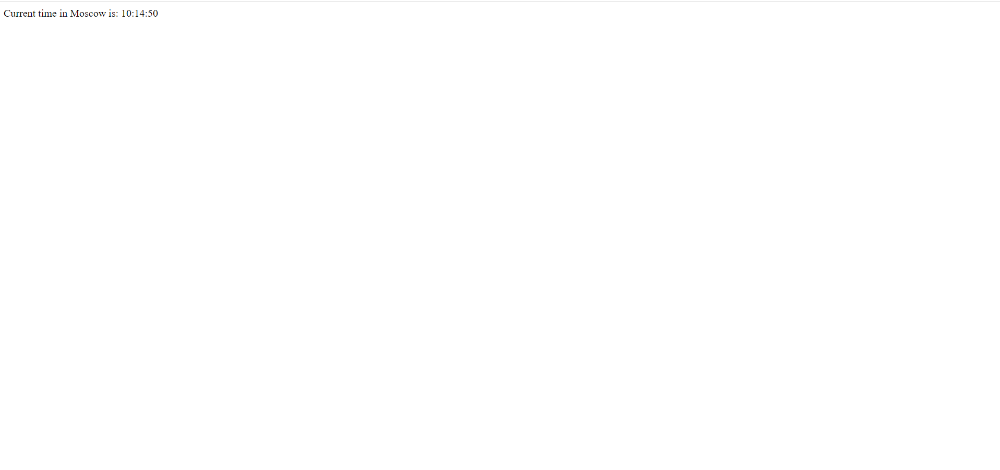

## Applied Dockerfile Best Practices

### 1) Scan for Security Vulnerabilities

I scanned my Dockerfile with the `docker scan time_flask_app:v0.2`
It performs active scans of my Docker image to identify key vulnerabilities.

### 2) Remove Unneeded Dependencies

Docker images should be as minimal as possible. Don’t install any packages or libraries that your application doesn’t actually use

In my dependencies I have only [Flask framework](https://flask.palletsprojects.com/en/2.2.x/). 

### 3) Use COPY Instead of ADD

Dockerfiles support two similar but subtly different instructions. ADD and COPY both let you add existing files to your image; whereas COPY only works with local files on your host, ADD also accepts remote URLs and automatically extracts tar archives. A simple ADD archive.tar has very different results from COPY archive.tar because the version using ADD will copy the contents of the archive, not the archive file itself.

Because ADD possesses this extra magic, it’s advisable to use COPY as your go-to when copying content from your file system. 

### Dockerfile Linter

For Dockerfile Linter I used [Hadolint](https://github.com/hadolint/hadolint). The linter parses the Dockerfile into an AST and performs rules on top of the AST.

To run it: 
1) Navigate to root folder of your project where `Dockerfile` is located.
2) Run command `docker run --rm -i hadolint/hadolint < Dockerfile`.

It founds 1 warning that was fixed by me later.

