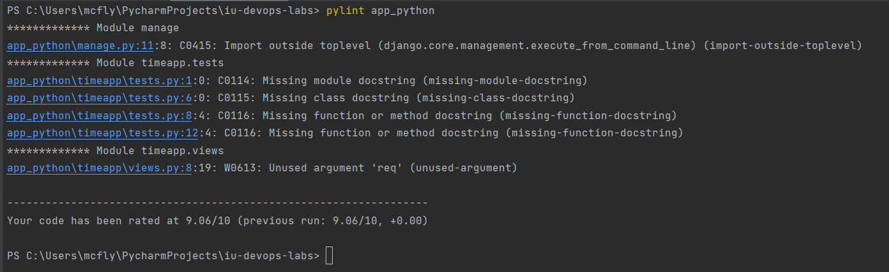

# Timeapp project

This app will help you to get current time in Europe/Moscow timezone in your browser.

## Overview of technology stack
This project is written using Django framework and run via Python 3.10.

### Why Django?
This framework is implemented in Python with a great documentation with many already implemented things inside. 
You don't need to write many things from scratch, most of the problems are already solved inside, so we just need
to configure some parameters and get a good result.

### Advantages of Django
* Great documentation
* Simple to run
* Small amount of vulnerabilities - better security
* MTV architecture
* Many web problems are already solved under the hood
* Has big community 
* Scalable - some big projects are written using Django(for example, Instagram or Pinterest)

### Disadvantages of Django
* Better for big projects as it's not ligth-weighted
* Monolithic way to create applications because of internal limitations of framework
* Lack of conventions in Django community

### Practices applied
1. Setup application for deployment: turn off DEBUG mode, SECRET_KEY is passed as env variable, set ALLOWED_HOSTS. 
2. Timeapp is written as a module to application.
3. Unit tests are written.
4. Linter is passed with the score 9.06/10.

### Code linter - Pylint
* Navigate to working dir ```/app_python/django_app```
* Install required python packages:
```shell
pip install -r requirements.txt
```
* Navigate to the root of the project ```/```
* Run linter:
```shell
pylint app_python
```
If everything is correct, you will see in the console:


## How to run?
* You should have pre-installed Python 3.10 and pip.
* Navigate to working dir ```/django_app```
* Install required python packages:
```shell
pip install -r requirements.txt
```
* Export secret key for application(it may be any string, keep it as secret!)
```shell
export SECRET_KEY=YOUR_SECRET_KEY
```
* Run all migrations
```shell
python manage.py migrate
```
* Run unit tests
```shell
python manage.py test
```
* Run application
```shell
python manage.py runserver
```
* The server will be started by default on port 8000. Open the following [link in your browser](http://localhost:8000/time/now).
If everything is correct, you will see the web page similar to the following one:

* Great! Everything works!

## How to use?
After running the project, open the following [link in your browser](http://localhost:8000/time/now).

## Contribution
You can contribute to our project - we are glad to new ideas. Just open pull requests. However, be sure to use pylint as a linter for your code.

## Credits
This project is developed by [@mcflydesigner, backend dev, devops](https://github.com/mcflydesigner) 

## License
The project is released and distributed under [MIT License](https://en.wikipedia.org/wiki/MIT_License).