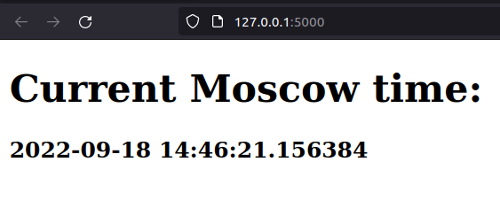

# Python time app

## Overview

When a server starts, one can open a given address in a browser to see current time in Moscow (MSK). The page will automatically refresh each 5 seconds.

## Best practices

What I did in this project

- Automatically generated the project via [manage-fastapi](https://github.com/ycd/manage-fastapi)
  - Project structure was explained on [SO](https://stackoverflow.com/a/64987404)

- Adapted An HTML [template](https://www.freecodecamp.org/news/html-starter-template-a-basic-html5-boilerplate-for-index-html/). There is an explanation of why specific tags vere included.

- Used [poetry](https://python-poetry.org/) for Python dependency management
  - Created an in-project virtual environment
  - Created a local poetry configuration

- [Adapted](https://github.com/svx/poetry-fastapi-docker) a ready image that correctly works for `poetry`

- Used linters and formatters (see the [Tools](./PYTHON.md#tools) section)

- Used the `Compose` schema in `docker-compose.yml` (provided by VSCodium)

- Applied PEP8 [recommendation](https://peps.python.org/pep-0008/#package-and-module-names) to name the code directory `time_app`

- Linted `Dockerfile` via [hadolint](https://github.com/hadolint/hadolint)

- Created a Nix flake with relevant scripts in output
  - the default `devshell` sources Python virtual environment when entering this directory

- Stored the app configuration in a `.env` file
  - It's checked into the repo since it contains non-sensitive data necessary to run this app

## Chosen framework

[FastAPI](https://fastapi.tiangolo.com/)

### Pros

- Fast
- Fast to code
- Fewer bugs (uses types extensively)
- Intuitive
- Easy
- Short (minimal code duplication)
- Robust
- Standards-based (OpenAPI)

### Cons

- `async`-s sometimes get in the way
 larger implementations

## Tools

Linters, checkers, formatters

### Python

- [mypy](https://github.com/python/mypy) - a static type checker
- [pylint](https://github.com/PyCQA/pylint) - a static code analyzer

### Markdown

- [markdownlint](https://github.com/DavidAnson/markdownlint) - a linter and formatter

### HTML & Jinja2

- [djlint](https://www.djlint.com/) - a [jinja2](https://jinja.palletsprojects.com/en/3.1.x/templates/) and `HTML` linter and formatter

### Dockerfile

See this [section](../README.md#docker)

## Unit tests

I followed the official fastapi [guide](https://fastapi.tiangolo.com/tutorial/testing/) on testing. This allowed me to use the [pytest](https://docs.pytest.org/en/7.1.x/) Python testing library. Next, I made a unit test that checks via [bs4](https://pypi.org/project/beautifulsoup4/) if a word is present on a page sent by the server.
