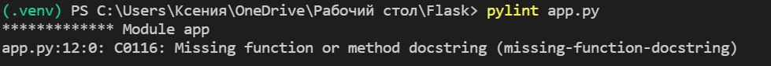
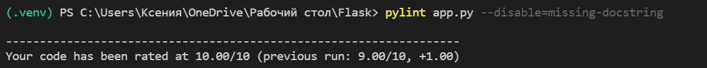
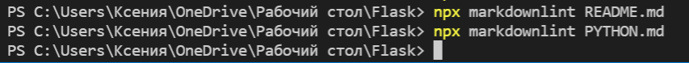
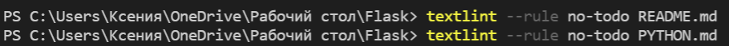
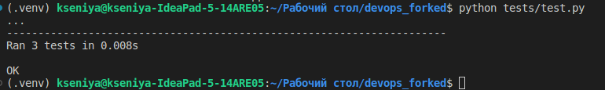

# Best practices in Python Web app

## The list of used practices

1. **Use Python 3** (Python 2 is officially not supported as
of January 1, 2020).
1. **Use virtual environment** for the project in
order to have an explicit structure of packages and
their versions in the system.
1. **Use `requirements.txt`** for the specification
for the needed packages.
1. **Use `.gitignore`** to exclude not relevant
files before git-commit.
1. **Use linters** to fix formatting, stylistic or other mistakes
or dangerous logic in python and markdown files
(the sections dedicated to them are listed below).
1. **Use static analysis tools** to easily detect
vulnerabilities or some problems. For instance, I have used:

    * [pylint](https://pylint.org)
    * [pyflakes](https://github.com/PyCQA/pyflakes)
    * [prospector](https://prospector.landscape.io/en/master/)

1. **Use pre-commit hooks** to automatically check
for errors before committing.
1. **Use separate "static" folder for styles using Flask**.
1. **Use templates folder for html templates using Flask**.
1. **Use the specific folder for images**.

## The reasoning of choosing Flask

There are several categories of frameworks in Python.
I started choosing the most appropriate framework
by choosing a category.  
Full stack frameworks are
a universal solution for large projects,
where a variety of forms and
templates. Nevertheless, in this case, we don't need
to use the database abstraction layer
or form validation functions and so on,
so it would be better to look at the
category of microframeworks.  
Now I'm faced with a choice:
Microframeworks or Asynchronous frameworks
(representing microframeworks).
Since this application will only be
displaying Moscow time information, the ability to
handling asynchronous actions is not necessary either.  
My next action was to investigate microframeworks,
among which Flask stood out significantly.
Due to its lightweight and modular design
Flask is an easily adaptable microframe.
Flask is also quite easy to learn in the beginning,
has a built-in fast debugger, and
it has support for unit testing.

### Pros of Flask

* Extremely flexible
* Minimalist without sacrificing power
* Simple to learn and use
* Easy to build prototypes
* Routing URLs is easy
* Small core and easily extensible
* Smaller application sizes due to the smaller codebase

### Cons of Flask

* Not async-friendly (and therefore, next point)
* Time-consuming in handling multiple requests
* Limited support and documentation
* Lack of database/ORM/forms
* Truly limited in features
* Security breach (Less number of tools need
more installation of modules that increases
the number of third-party tools.
This could pose security challenges)

* Expensive for complex systems

## Linters for Python

* **flake8**  

Flake8, combines the best practices from pep8,
pyflakes and circular complexity for detecting
logical problems in the code or potential
errors.  
It also has a low rate of false positives.  
My app.py was formatted by the flake8 standarts.

* **pylint**  

Then I have used pylint and slightly modified
the code: added the docstring at the beginning
and placed "from datetime import datetime"
before "from flask import Flask".  

  

The correction process of such error led to the
contradiction with flake8, so I disabled the
verification of the missing-docstring.
Nevertheless, the current function has no extra need
to be specified, since its only function in
this program has the functionality described in
the formulated purpouse of the app.  

## Linters for Markdown

* **markdownlint**  

It is highly ranked for
the formatting in the
[following article](https://earthly.dev/blog/markdown-lint)):  

* **textdown**  

Textdown linter is highly ranked in the premise article
for its ability to detect
the spelling, grammar and clarity errors.  
As the screenshot shows, all of the problems
were fixed before the Lab submission.  

## Linter for yaml (Configuration for CI)

I have used one of the most popular linters for linting yaml-files - **yamllint**.

## Unit Tests

I have created 3 tests for checking the status code of the app
(should be equal to 200), the correctness of the time format and
the last one is about the presense of a confetti piece.
If the app is not responding in 20 seconds, the timeout exception
is raised.  
As it is shown on the picture below, all of the tests were successfully passed.

### Best practices for Unit Tests

* **Fast**.  
For instance, the Mocha testing framework, by default,
considers any test that takes more than 75ms to run as a slow test.
My tests are ran in 8ms.
* **As simple as possible**.  
McCabe complexity is not excessed.
* **Don't depend on other tests**.  
Each of my tests is responsible
for the single feature.
* **Test shouldn’t duplicate implementation logic**.
* **Tests are readable**.  
For example, I am using 1 assertion per method.
Also, all of the variables are properly named.
* **Tests are deterministic**.  
They don't depend on other test cases,
environmental values (such as the current time, or language settings
of the computer it’s running on), external dependencies (such as
the file system, network, APIs, etc).
* **Sound Naming Convention for Your Tests**.  
The tests are regarded
as the part of the documentation.
Therefore, the names of the functions are quite specific.
* **The explicit folder with tests**
