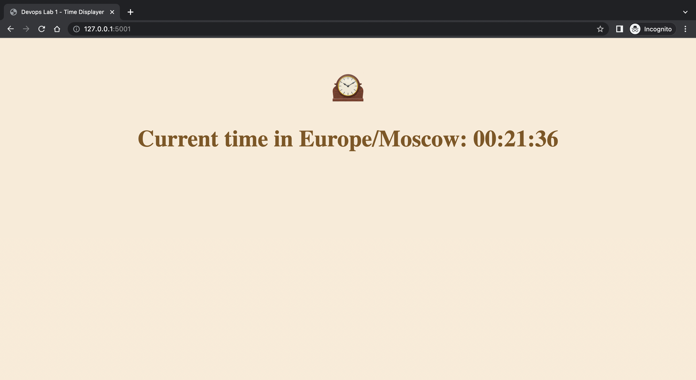
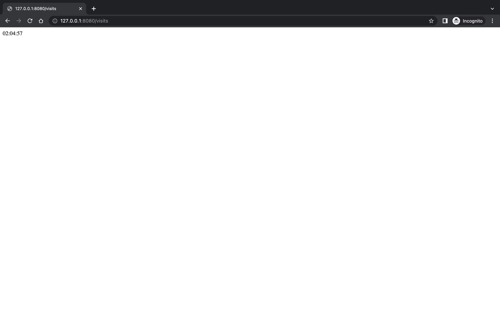

[](https://github.com/desmigor/devops-labs/actions/workflows/app_python.yml)

# Time Displayer Simple Web App
> Innopolis University, F22
>
> Devops Course Lab 1



## 1. Overview

This is a simple web app that displays current time in Moscow or any of your location. The server copies the OS time to a file called `time.txt`. The time that is saved in `time.txt` is copied to a variable `time-zone` and `time` then displayed in `index.html`. 

## 2. Built with

This app server is built with a Production ready web-framework `Flask`.


## 3. How To Run Locally

1. Install `virtualenv`:
```
$ pip install virtualenv
```

> Or for Updated version of pip

```
$ pip3 install virtualenv
```

2. Open a terminal in the project root directory and run:
```
$ virtualenv env
```

3. Then run the command:
```
Windows: $ .\env\Scripts\activate
Unix: $ source env/bin/activate
```

4. Then install the dependencies:
```
$ (env) pip install -r requirements.txt
```

5. Finally start the web server:
```
$ (env) python app.py
```

This server will start on port 5001. You can change this in `app.py` by changing the following line to this:

```python
if __name__ == "__main__":
    app.run(port=<desired port> , debug=True)
```

### 3.2 Lab 12: Adding new app endpoint

The app is now configured with new end poin `/visits` that shows the time when the root path `/` was accessed by the client.




## 4. Docker Containerization

### 4.1 Steps Followed to Create a Public Docker Image

1. Create a `Dockerfile` with instrunctions
2. Created a new `public` repository on my Docker Hub account
3. Built the image for `AMD64` on a Linux Machine  using `docker build -t migorr/time-app-devops:amd64 .`
4. Tested the image locally using `docker run migorr/time-app-devops:amd64`
5. Pushed the image `docker push migorr/time-app-devops:amd64`
6. Built the image for `ARM64` on a M1 Mac Machine  using `docker build -t migorr/time-app-devops:arm64 .`
7. Tested the image locally using `docker run migorr/time-app-devops:arm64`
8. Pushed the image `docker push migorr/time-app-devops:arm64`
9. Images are built using Github workflow

### 4.2 Running the Docker image

For Running the image, use the command:

```
docker run -p 8080:8080 migorr/time-app-devops:latest
```

## 5. Unit Tests

For running unit tests, use this command:

```
pytest
```
Or

```
python -m pytest
```

You can add a `-v` at the end of the above commands for verbose output of the tests run.

## 6. Continous Integration (CI)

This repository CI setup and it automates linting, unit testing and publishing a new Docker image to a remote repository.


## 7. Usage

This app is straight-foward. After app is running property, the time will be displayed. You can refresh you page to make sure the time is still showing correctly.


## 8. License

Distributed under the MIT License. See `LICENSE.txt` for more information.

## 9. Contact

- For Contact: Igor Mpore - [Contact Email](mailto:i.mpore@innopolis.university)
- Project Link: [https://github.com/desmigor/devops-labs](https://github.com/desmigor/devops-labs)
