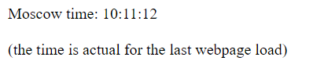

# Moscow time webpage

## Description of product
This is a simple web application to show the current time for Moscow time zone (UTC+3). It does not update the time after the page load though. 

The correctness of time depends on local system time no matter the system timezone.

The web page user interface

## Requirements
- The Python 3.9 or newer version is required to run the application. 
- UNIX-like or Windows system with the correct time set (the timezone can be different from Europe/Moscow)
- Access to network or Internet (or only localhost address is available) 

## Build
No building is required for this source code since Python is an interpreted language.

## Usage
There are 2 ways for running this application:
### Docker (preferable)
1. Download the code to your local machine - to be more specific, `main.py` & `requirements.txt` are required
2. Download `Dockerfile` and use `docker build -t andrew174194/msc_time_py .` to build container by yourself OR
    use pre-build container with command `docker pull andrew174194/msc_time_py` ([Link to image on Docker Hub](https://hub.docker.com/r/andrew174194/msc_time_py))
3. Run container by `docker run -p 80:5000 andrew174194/msc_time_py`, the web-application will be available on `localhost` or `localhost:80`. You can change 80 port to other port you like.

### By hands
1. Enter the base folder and clone `app_python` folder there
2. Run `python -m venv venv` to create a virtual environment
3. Start the virtual environment with `./Scripts/Activate` command (be sure about execution rights)
4. Change directory to `app_python` and install requirements by `pip install -r requirements.py`
5. Start the application with `python main.py` or `python3 main.py` command
6. Access the webpage via printed address (`localhost:5000` by default)

To finish the server press `Ctrl + C` buttons

## Unit testing
In Docker container unit tests start automatically after the start of service

To run tests manually, use `python test.py` inside `app_python` folder

## GitHub Actions
On every push or pull request to labs branches the CI workflow starts. 

Workflow steps:
1) Set up Python 3.9
2) Install dependencies
3) Linker for Python code
4) Unit tests
5) Login to Docker Hub & push new image (pay attention to set `DOCKER_HUB_USERNAME` and `DOCKER_HUB_ACCESS_TOKEN` secrets)

## Author
Andrey Khoroshavin

kill team, B19-CS-01 academic group, Innopolis University

a.khoroshavin@innopolis.university

September 2022
