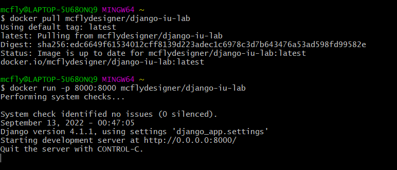

# Timeapp project

This app will help you to get current time in Europe/Moscow timezone.
This project is written using Django framework.

[](https://github.com/mcflydesigner/iu-devops-labs/actions/workflows/app_python.yml)

## Docker
Link to the [image on docker hub](https://hub.docker.com/repository/docker/mcflydesigner/django-iu-lab)

The build is multistage and described in `./Dockerfile`.

### How to run?
* Pull the image from docker hub
```shell
docker pull mcflydesigner/django-iu-lab:latest
```
* Run the image binding your port 8000 to container's port 8000(application will be listening this port). 
```shell
docker run -p 8000:8000 mcflydesigner/django-iu-lab:latest
```
If everything is great, you will see the following message in your console:

To see the webpage, open the following [link in your browser](http://localhost:8000/time/now).


## How to run without Docker?
* You should have pre-installed Python 3.10 and pip.
* Navigate to working dir ```/app_python/django_app```
* Run in your terminal:
```shell
pip install -r requirements.txt
```
* Export secret key for application(it may be any string, keep it as secret!)
```shell
export SECRET_KEY=YOUR_SECRET_KEY
```
* Run all migrations
```shell
python manage.py migrate
```
* Run application
```shell
python manage.py runserver
```
* The server will be started by default on port 8000. Open the following [link in your browser](http://localhost:8000/time/now).
If everything is correct, you will see the page similar to the following one:

* Great! Everything works!

## Unit tests

The tests are written for 2 modules of the application: *core django_app* and *timeapp*.

### Testing scenarios:
* Correct time 
* Correct time when refresh page
* Not found page

### Best practices applied
* Each test checks 1 scenario
* Tests are simple
* Tests are fast
* Tests are grouped within different modules
* Tests are documented

## CI/CD

For CI/CD I am using Github Actions. For python application, 
the workflow in described in [.github/workflows/app_python.yml](../.github/workflows/app_python.yml) 

### How does pipeline work?

The CI/CD pipeline consists of the following jobs:
* `linter_and_tests` - installing dependencies, running linter and tests
* `security` - running Snyk
* `docker-container` - creating docker image and pushing it to docker hub (run only iff 2 previous are successfully passed)

## Monitoring

Monitoring is performed with the use of Prometheus.

URL: /metrics

Healthcheck URL: /healthcheck