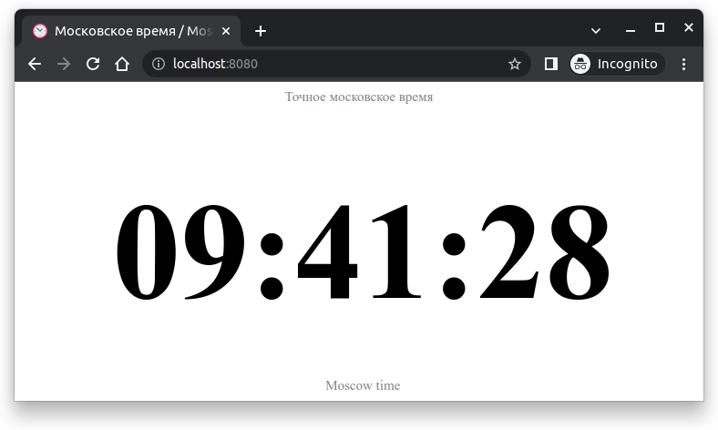

 


<div align="center">
  <br/>
  <h1>Superclock</h1>
  <p>Simple Python web application, that shows current time in Moscow</a></p>
</div>

## 📝 About The Project

The repository contains a simple python web application which shows the server time in Moscow. Time is updated when you refresh the page.

The application is written using the [FastAPI](https://fastapi.tiangolo.com/) framework. [Uvicorn](https://www.uvicorn.org/) (ASGI web server) is used to run the application. [Poetry](https://python-poetry.org/) is used for the dependency management. In addition, the application can be run inside a [Docker](https://www.docker.com/) container.

<div align="center">
  
</div>

## ⚡️ Quick start (for Linux only)

1. Download the repository and change the current directory:

   ```bash
   git clone https://github.com/Markovvn1/devops-labs.git && cd devops-labs
   ```

2. Switch to lab3 branch and open project's directory:

   ```bash
   git checkout lab3 && cd app_python
   ```

3. Configure virtual environment. Before proceeding, make sure you have installed [build-essential](https://packages.debian.org/en/sid/build-essential) (to be able to use `make` command) and python [venv module](https://docs.python.org/3/library/venv.html). This command should create the `.venv` folder with python virtual environment.

   ```bash
   make venv
   ```

4. Run the project:

   ```bash
   make up
   ```

5. Open the website `http://localhost:8080/` to view the server time in Moscow.

### :whale: Docker-way to quick start

Before proceeding, make sure you have installed [Docker](https://docs.docker.com/engine/install/).

1. Run docker container (support linux/amd64, linux/386, linux/arm64, linux/arm/v7):

   ```bash
   docker run -it --rm -p 8080:80 markovvn1/iu-devops:lab3-python
   ```

2. Open the website `http://localhost:8080/` to view the server time in Moscow.

## ⚙️ Developing

Configure virtual environment. Make sure a `.venv` folder has been created after this step.

```bash
make venv
# source .venv/bin/activate
```

Run the project in developing mode (with auto reloading):

```bash
make up_dev
```

Run linters, formaters and tests:

```bash
make lint  # check code quality
make format  # beautify code
make test  # run unit and integrated tests
```

Build docker image:

```bash
make build_docker
```

## :computer: Contributors

<p>

  :mortar_board: <i>All participants in this project are undergraduate students in the <a href="https://apply.innopolis.university/en/bachelor/">Department of Computer Science</a> <b>@</b> <a href="https://innopolis.university/">Innopolis University</a></i> <br> <br>

  :boy: <b>Vladimir Markov</b> <br>
  &nbsp;&nbsp;&nbsp;&nbsp;&nbsp; Email: <a>Markovvn1@gmail.com</a> <br>
  &nbsp;&nbsp;&nbsp;&nbsp;&nbsp; GitLab: <a href="https://gitlab.com/markovvn1">@markovvn1</a> <br>
  &nbsp;&nbsp;&nbsp;&nbsp;&nbsp; Githab: <a href="https://github.com/markovvn1">@markovvn1</a> <br>
</p>
