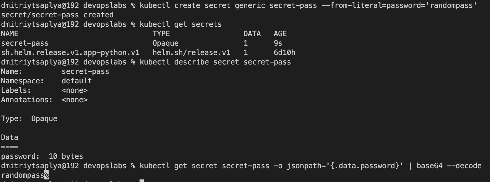

- `kubectl create secret generic secret-pass --from-literal=password='randompass'`

- `kubectl get secrets`

- `kubectl describe secret secret-pass`

- `kubectl get secret secret-pass -o jsonpath='{.data.password}' | base64 --decode`

