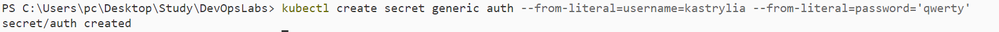
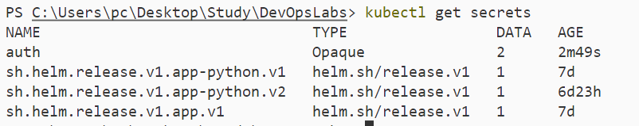
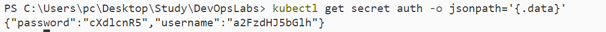
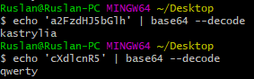
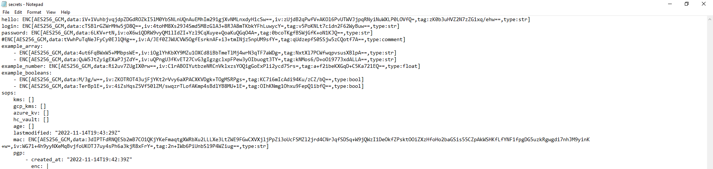
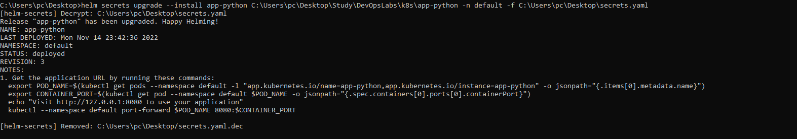
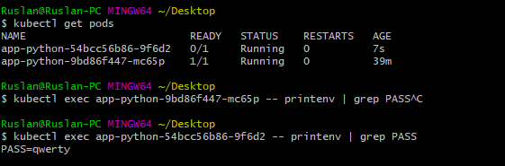
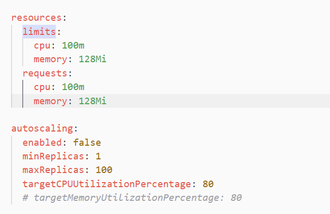
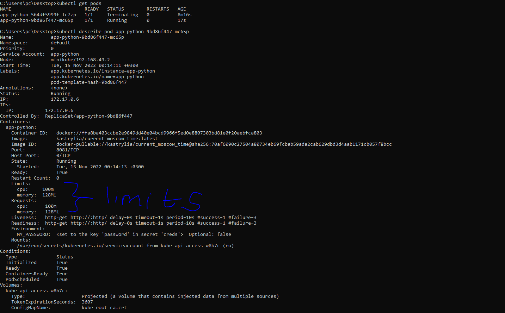

# kubectl
## secret creation and verification

## secret decoding

# helm
## Generated secrets.yaml via sops

## update the pod

## getting password

# requests and limits for CPU and memory  
## modyfying values.yaml

## pod description
