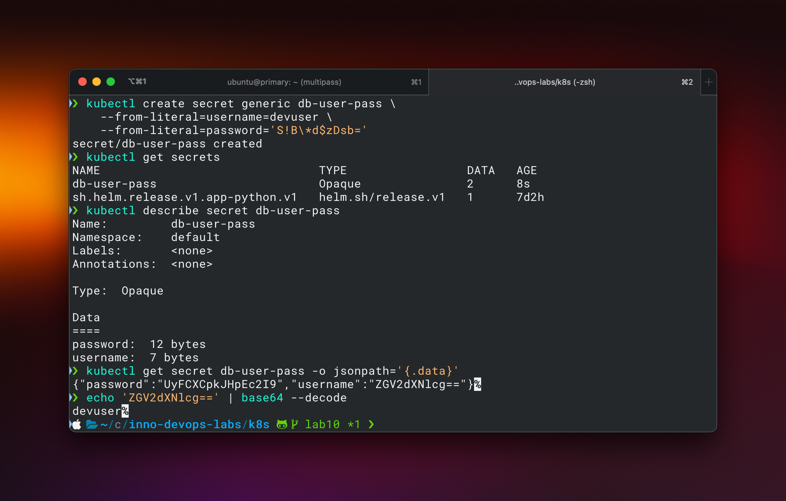

# Lab 11

## Using kubecl secrets



## Using help secrets plugin

```bash
kubectl exec app-python-65f848fc7c-56j85 -- printenv | grep 'PASSWORD'
MY_PASSWORD=bebra
```

## Using limits

```bash
kubectl describe pod app-python | grep -A 6 Limits
    Limits:
      cpu:     500m
      memory:  128Mi
    Requests:
      cpu:        250m
      memory:     64Mi
    Environment:  <none>
```
