## Lab 11

### Part 1 - Secrets

- `kubectl create secret generic prod-credentials --from-literal=username=produser --from-literal=password=aladdinych`

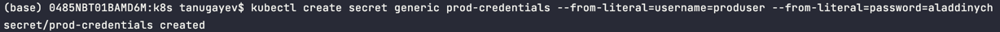

- `kubectl get secrets`

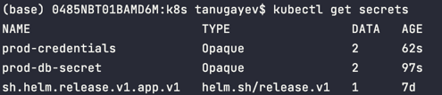

- `kubectl get secret prod-credentials -o jsonpath='{.data}'`

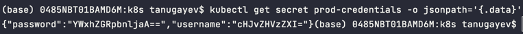

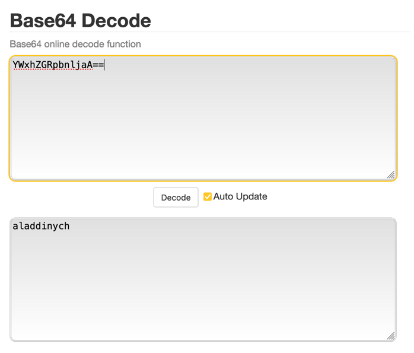

### Part 2 - Helm secrets

- `gpg --list-keys`

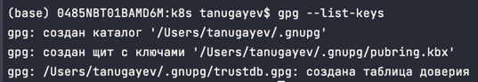

- `gpg --gen-key`

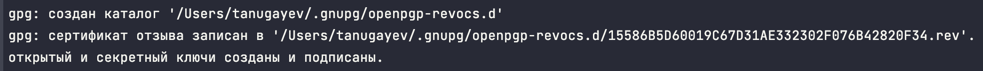

- `gpg --list-keys`

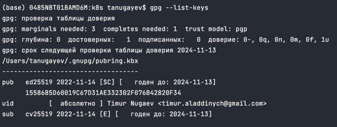

- `sops -p 15586B5D60019C67D31AE332302F076B42820F34 secrets.yaml`

in the file: `password: secret123`

- `helm secrets view secrets.yaml`

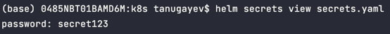

- `helm secrets upgrade --install time-app ./time-app -n default -f ./secrets.yaml`

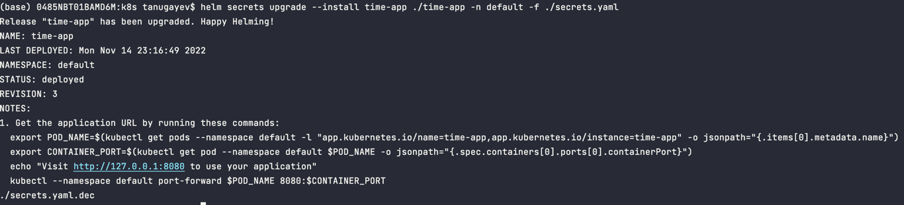

- `kubectl get pods`

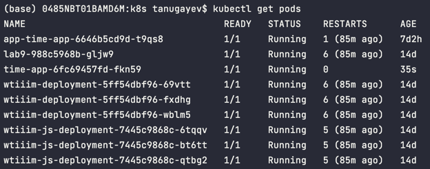

- `kubectl exec time-app-6fc69457fd-fkn59 -- printenv | grep MY_PASSWORD`

we get our secret back from inside the pod:

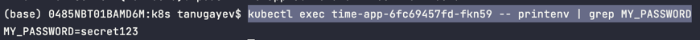

### Part 3 - Resource management

set `values.yaml`

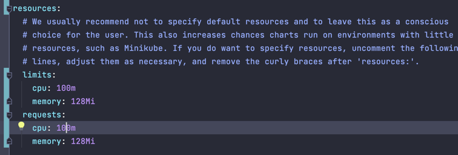

upgrade helm

check that limits and requests on the pod correspond to the ones i set in the `values.yaml`

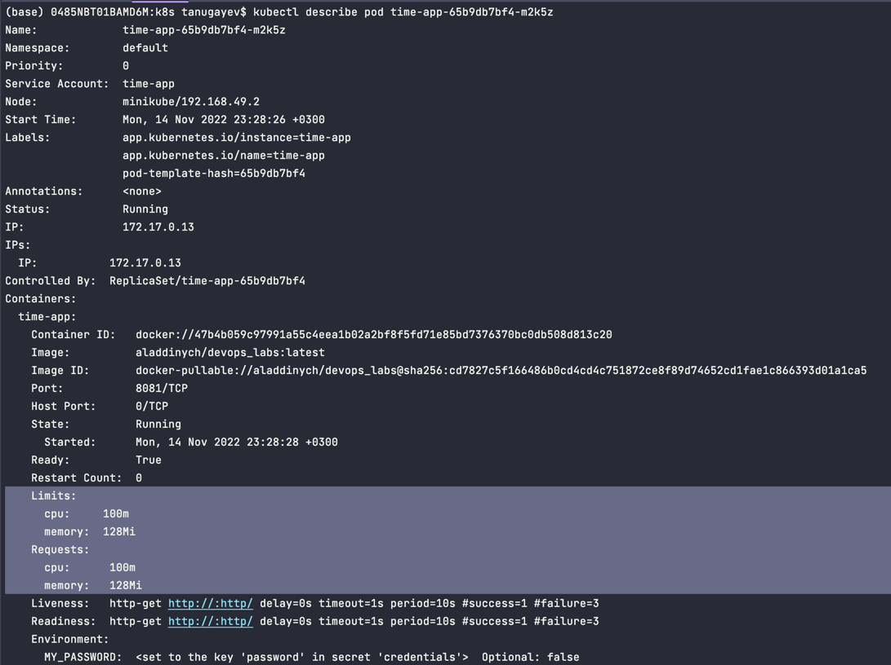