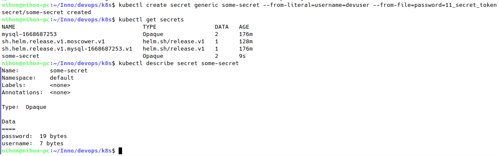
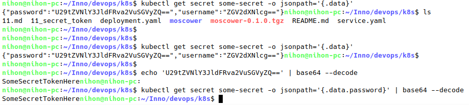
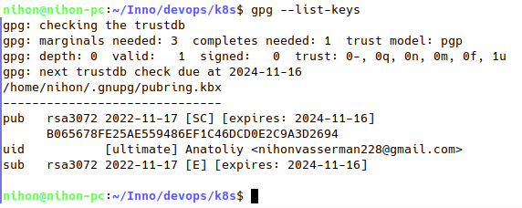
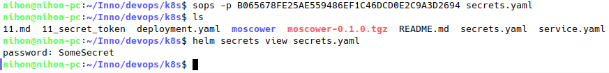
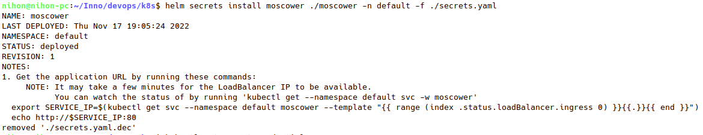
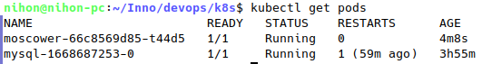
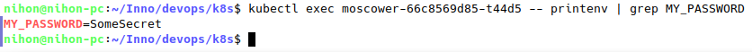
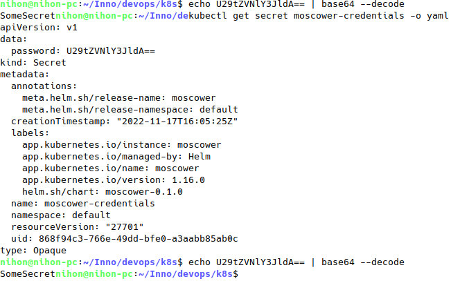

# Secret

## Create and verify

## Decode secret

## GPG

After generating a key

Afterwards a secret was created with *sops*

## App with secret

Installation

Pods

Get secret through *kubectl exec*

Get secret through *kubectl get*

