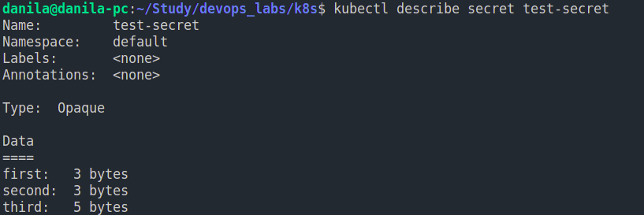
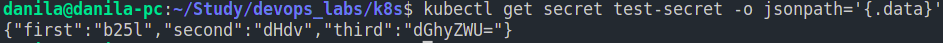
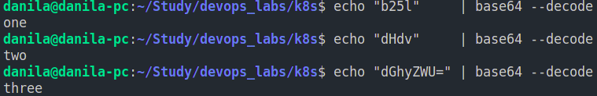
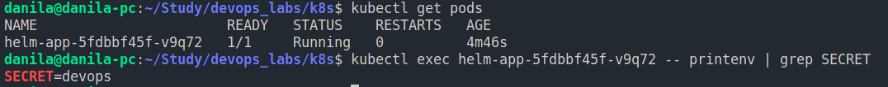
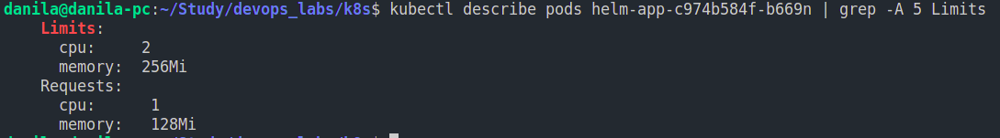
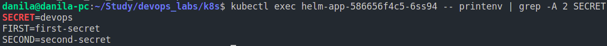

# K8s secrets and resources

## Creating a secret using *kubectl*

```bash
    kubectl create secret generic test-secret \
    --from-literal=first=one \
    --from-literal=second=two \
    --from-literal=third=three 
```

## Verifying the secret

Output of ``kubectl get secrets``:


Output of ``kubectl describe secret test-secret``:



Output of ``kubectl get secret test-secret -o jsonpath='{.data}':



Decode secrets:



## Helm secrets

1. Install Helm Secrets Plugin:

    ``helm plugin install https://github.com/jkroepke/helm-secrets``

2. Create keypair using GPG:

    ``gpg --gen-key``

3. Create secret:

    ``sops -p <gpg_fingerprint> secrets.yaml``

4. Update *templates/secrets.yaml* and *templates/deployment.yaml*

5. Install Helm app

    ``helm secrets install helm-app ./helm-app/ -f secrets.yaml -f ./helm-app/python-values.yaml``

6. Verify the secret is available

    

## Requests and limits for CPU and memory

 1. Modify field *resources* in *values.yaml*

 2. Deploy application

 3. Output of ``kubectl describe pods <pod_name> | grep -A 5 Limits``

     

## ENV variables using named templates


