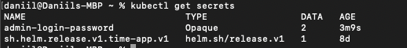
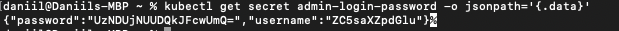
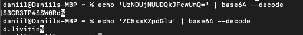
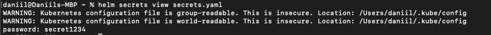
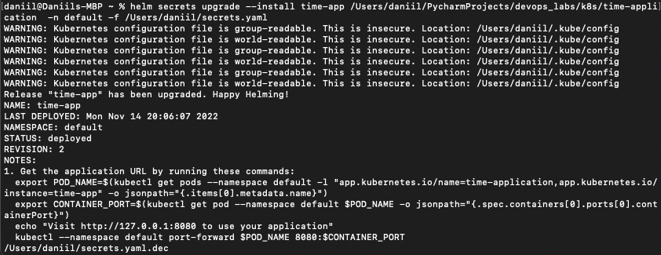
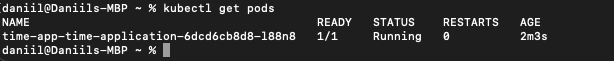
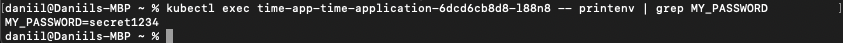

# Secrets inside k8s and helm

## Secrets with kubectl

1) Creation of secret


2) Verification of secret 



3) Decode the overall secret



4) Decode login and password


## Secrets with helm


1) Firstly, let's generate key pair using `gpg --gen-key`


2) Then, I create a secret using command `sops -p <my_fingerpring> secrets.yaml`


3) Then we can check that helm actually can decrypt it: 



4) Let's update our deployed pod with command: `helm secrets upgrade --install time-app /Users/daniil/PycharmProjects/devops_labs/k8s/time-application  -n default -f /Users/daniil/secrets.yaml`:



5) Get pods:



6) Check secret inside the pod: 

So, everything works correctly.


## Resource management

1) To set up limits for CPU and memory, you need to change values inside  `k8s/time-application/values.yaml`


2) I set them to that values:
```
limits:
  cpu: 150m
  memory: 128Mi
 requests:
  cpu: 150m
  memory: 128Mi
```


3) Now, let's helm upgrade and check that pod has exactly this values:


   