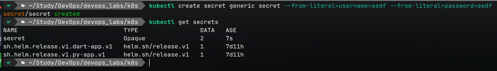

# Lab 11

## Step 2



## Step 3

1. Gen new key
2. Gen `secrets.yaml` with fingerprint
3. Results in [secrets.yaml](./helm/secrets.yaml) file
4. I can get them with

    ```bash
    $ helm secrets view secrets.yaml
    username: aboba
    password: bebra
    ```

5. Add [secrets.yaml](./helm/package/templates/secrets.yaml) in helm package
6. Update [deployment.yaml](./helm/package/templates/deployment.yaml) and [values.yaml](./helm/package/values.yaml) in helm package
7. Compile new package with `helm package helm/package`
8. Install python and dart apps with sicrets

    ```bash
    $ helm secrets install py-app app-0.1.0.tgz -f ./helm/secrets.yaml
    NAME: py-app
    LAST DEPLOYED: Mon Nov 14 10:47:32 2022
    NAMESPACE: default
    STATUS: deployed
    REVISION: 1
    TEST SUITE: None
    removed './helm/secrets.yaml.dec'
    $ helm secrets install dart-app app-0.1.0.tgz -f ./helm/secrets.yaml -f ./helm/dart_values.yml
    NAME: dart-app
    LAST DEPLOYED: Mon Nov 14 10:47:37 2022
    NAMESPACE: default
    STATUS: deployed
    REVISION: 1
    TEST SUITE: None
    removed './helm/secrets.yaml.dec'
    $ kubectl get pods,svc
    NAME                            READY   STATUS    RESTARTS   AGE
    pod/dart-app-796bdd6b4b-5d8l4   1/1     Running   0          12s
    pod/dart-app-796bdd6b4b-8c98d   1/1     Running   0          12s
    pod/dart-app-796bdd6b4b-dtfrl   1/1     Running   0          12s
    pod/py-app-5d6c84bff8-8fcqh     1/1     Running   0          17s
    pod/py-app-5d6c84bff8-kkgq4     1/1     Running   0          17s
    pod/py-app-5d6c84bff8-wbkm2     1/1     Running   0          17s
    ```

9. Check the env

    ```bash
    $ kubectl exec dart-app-796bdd6b4b-5d8l4 -- printenv
    PATH=/usr/local/bin:/usr/local/sbin:/usr/local/bin:/usr/sbin:/usr/bin:/sbin:/bin
    HOSTNAME=dart-app-796bdd6b4b-5d8l4
    USERNAME=aboba # dart username
    PASSWORD=bebra # dart password
    ... # Removed extra lines to reduce text
    $ kubectl exec py-app-5d6c84bff8-wbkm2  -- printenv
    PATH=/usr/local/bin:/usr/local/sbin:/usr/local/bin:/usr/sbin:/usr/bin:/sbin:/bin
    HOSTNAME=py-app-5d6c84bff8-wbkm2
    USERNAME=aboba # python username
    PASSWORD=bebra # python password
    ... # Removed extra lines to reduce text
    ```

## Step 4

1. Update [values.yaml](./helm/package/values.yaml) with resources
2. Add resources to [deployment.yaml](./helm/package/templates/deployment.yaml)
3. Repeat steps 8 and 9 from [step 3 section](#step-3)
4. Look for limits and requests

    ```bash
    $ kubectl get pods,svc 
    NAME                            READY   STATUS    RESTARTS   AGE
    pod/dart-app-75ccf68c5b-jzwpq   1/1     Running   0          8m31s
    pod/dart-app-75ccf68c5b-rqlzg   1/1     Running   0          8m31s
    pod/dart-app-75ccf68c5b-xq4dg   1/1     Running   0          8m31s
    pod/py-app-f9fc7fbb8-lddrv      1/1     Running   0          8m20s
    pod/py-app-f9fc7fbb8-p8rg5      1/1     Running   0          8m20s
    pod/py-app-f9fc7fbb8-r2nwv      1/1     Running   0          8m20s

    NAME                 TYPE           CLUSTER-IP      EXTERNAL-IP   PORT(S)        AGE
    service/dart-app     LoadBalancer   10.111.67.228   <pending>     81:32241/TCP   8m31s
    service/kubernetes   ClusterIP      10.96.0.1       <none>        443/TCP        7d15h
    service/py-app       LoadBalancer   10.100.76.18    <pending>     80:30819/TCP   8m20s
    $ kubectl get pod dart-app-75ccf68c5b-jzwpq -o=jsonpath='{..resources.limits}'


    {"cpu":"100m","memory":"128Mi"}
    $ kubectl get pod dart-app-75ccf68c5b-jzwpq -o=jsonpath='{..resources.requests}'


    {"cpu":"10m","memory":"128Mi"}
    ```