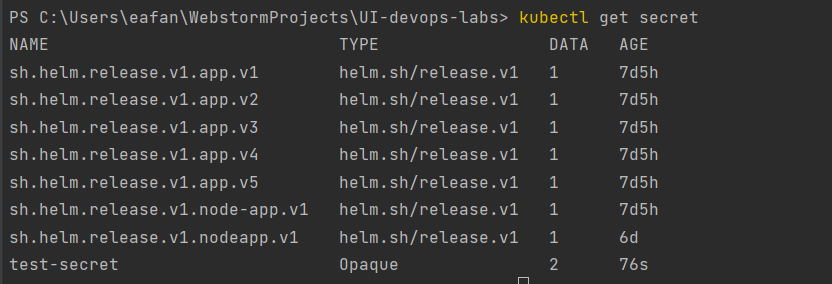
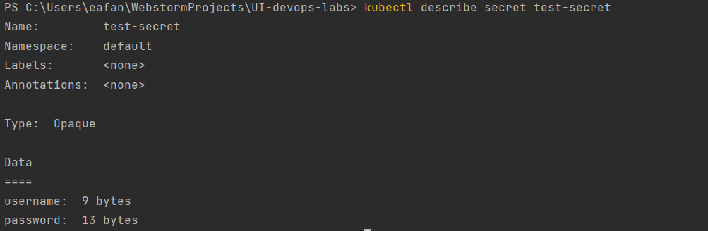
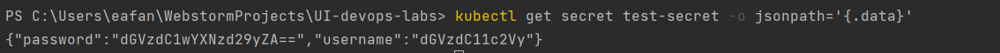
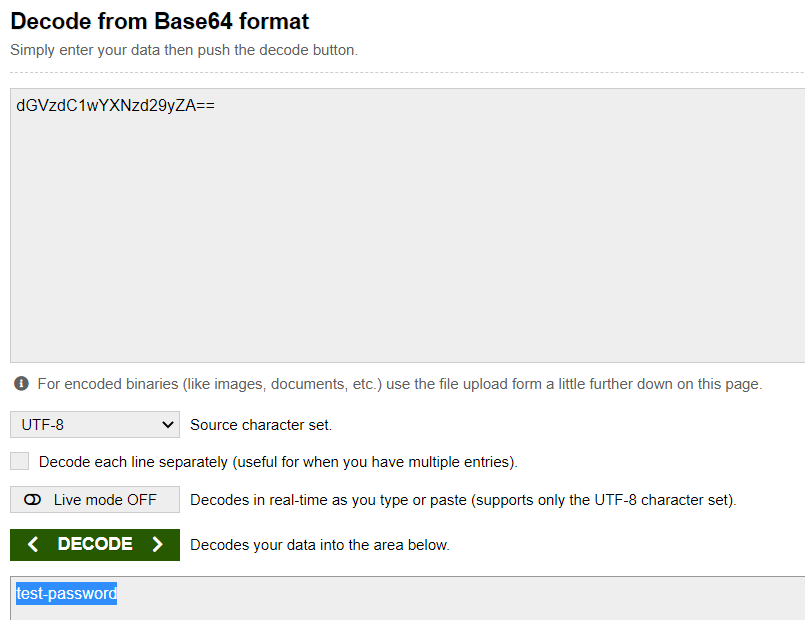
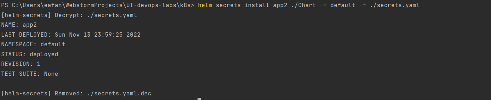

get secret:

verify:

encode:

decode:

run helm:

## Pod instance info:
PS C:\Users\eafan\WebstormProjects\UI-devops-labs\k8s> helm secrets install app2 ./Chart -n default -f ./secrets.yaml    
KUBERNETES_PORT_443_TCP_PORT=443
APP2_SERVICE_SERVICE_PORT_NODE_APP_LISTENER=8080
APP2_SERVICE_PORT=tcp://10.104.16.130:8080
APP2_SERVICE_PORT_8080_TCP_PROTO=tcp
APP2_SERVICE_PORT_8080_TCP_ADDR=10.104.16.130
MY_PASSWORD: test-password
NODE_VERSION=18.10.0
YARN_VERSION=1.22.19
HOME=/root

