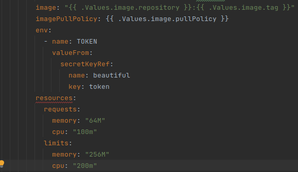

# lab 11

## Create secrets

I create a secret with next kubectl command:

`$ kubectl create secret generic secret-key --from-literal=token=Juli3Doe3Not
`

Next I verify secret

```
$ kubectl get secrets
NAME                            TYPE                 DATA   AGE
secret-key                      Opaque               1      48s
$ kubectl describe secret secret-key
Name:         secret-key
Namespace:    default
Labels:       <none>
Annotations:  <none>

Type:  Opaque

Data
====
token:  12 bytes
$ kubectl get secret secret-key -o jsonpath={.data.token}
SnVsaTNEb2UzTm90
$ echo 'SnVsaTNEb2UzTm90' | base64 --decode
Juli3Doe3Not
```

## Using Helm
I created env variable for helm cluster from lab10.

I added `secrets.yaml` and changed `deployment.yaml`

here is the lines added to `deployment.yaml`



Next, I typed `kubectl describe pod`

```
Containers:
  chart-clocker:
    Container ID:   
    Image:          254689393895236/clock-clock:v1.0.0
    Image ID:       
    Port:           5000/TCP
    Host Port:      0/TCP
    State:          Waiting
      Reason:       ContainerCreating
    Ready:          False
    Restart Count:  0
    Limits:
      cpu:     200m
      memory:  256M
    Requests:
      cpu:      100m
      memory:   64M
    Liveness:   http-get http://:http/ delay=0s timeout=1s period=10s #success=1 #failure=3
    Readiness:  http-get http://:http/ delay=0s timeout=1s period=10s #success=1 #failure=3
    Environment:
      TOKEN:  <set to the key 'token' in secret 'beautiful'>  Optional: false
    Mounts:
      /var/run/secrets/kubernetes.io/serviceaccount from kube-api-access-d7vlf (ro)
```

here we see the lines for limits and request and also for environment


