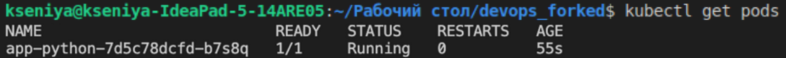
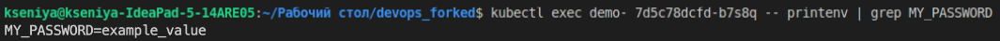
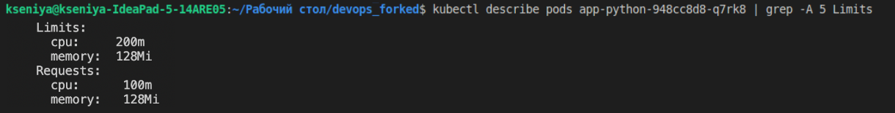
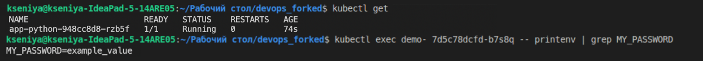

# Lab 11

## K8s secrets and resources

1. A secret was created in my cluster using `kubctl` command.

    ```bash
    % kubectl create secret generic my-secret \
    --from-literal=username='admin' \
    --from-literal=password='admin-pass'
    secret/my-secret created
    ```

1. I verified my secret

    ```bash
    % kubectl get secrets
    NAME                               TYPE                 DATA   AGE
    my-secret                   Opaque               2      2m37s
    sh.helm.release.v1.app-python.v1   helm.sh/release.v1   1      1d23h
    ```

1. There are the details of the secret:

    ```sh
    kubectl describe secret my-secret
    Name:         my-secret
    Namespace:    default
    Labels:       <none>
    Annotations:  <none>
    Type:  Opaque
    Data
    ====
    password:  10 bytes
    username:  5 bytes
    ```

1. Decode the secret:

    View the contents of the secret created:
    ```sh
    kubectl get secret my-secret -o jsonpath='{.data}'

    {"password":"XSRtaM2tcUFzcw5E","username":"YWRtaW4="}% 
    ```

    Decode the password data:
    ```sh
    echo 'XSRtaM2tcUFzcw5E' | base64 --decode
    admin-pass%  
    ```

1. So the configuration file for secret is skipped, let's use helm.

1. First od all, Helm Secrets plugin was installed:

    ```bash
    helm plugin install https://github.com/jkroepke/helm-secrets
    Installed plugin: secrets
    ```

1. The next step is the installation of `gpg` and `sops`. Prerequisites: you will need Homebrew:

    ```bash
    brew install gpg
    brew install sops
    ```

    Generate keys:

    `gpg --gen-key`

1. I created `secrets.yaml` file in `templates` folder, a `secret` objectand an `env` field was added to my `Deployment` file.

    `sops -p <gpg_fingerprint> secrets.yaml`

    Create `secrets.yaml` file in `k8s/app-python/templates` folder;

    Add `env` field to `k8s/app-python/templates/deployment.yaml`.

1. As a next step, the app was installed:

    `helm secrets install app-python ./app-python/ -f ./secrets.yaml`

    ```sh
    % helm secrets install app-python ./app-python/ -f ./secrets.yaml
    ./secrets.yaml.dec is newer than ./secrets.yaml
    NAME: app-python
    LAST DEPLOYED: Mon Dec 19 01:46:15 2022
    NAMESPACE: default
    STATUS: deployed
    REVISION: 1
    NOTES:
    1. Get the application URL by running these commands:
        NOTE: It may take a few minutes for the LoadBalancer IP to be available.
            You can watch the status of by running 'kubectl get --namespace default svc -w app-python'
    export SERVICE_IP=$(kubectl get svc --namespace default app-python --template "{{ range (index .status.loadBalancer.ingress 0) }}{{.}}{{ end }}")
    echo http://$SERVICE_IP:80
    ```

1. The result of the command `kubectl get pods`:

    ```sh
    % kubectl get pods
    NAME                          READY   STATUS    RESTARTS   AGE
    app-python-7d5c78dcfd-b7s8q   1/1     Running   0          34s
    ```

    

1. I checked my secret inside pod: `kubectl exec demo- 7d5c78dcfd-b7s8q -- printenv | grep MY_PASSWORD`
    

1. I read about Resources management:

    * [Resource management](https://kubernetes.io/docs/concepts/configuration/manage-resources-containers/)

1. Set up requests and limits for CPU and memory for your application in `app-python/values.yaml` and tested that it works:

    `kubectl describe pods app-python-948cc8d8-q7rk8 | grep -A 5 Limits`

    

## Bonus

1. Helm chart was updated with several environment variables that were added to `_helpers.tpl` file

1. Test that it works:

    
