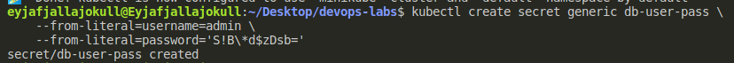
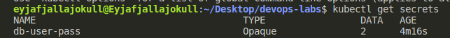
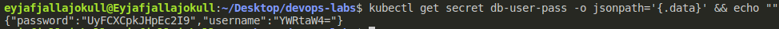
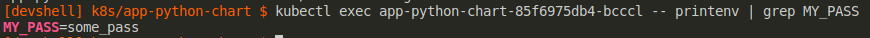
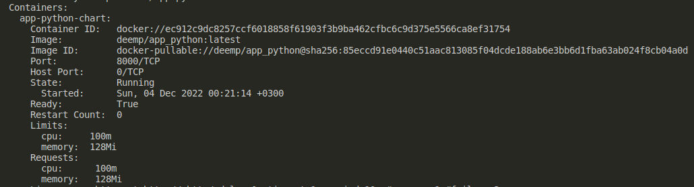

# Lab 11

## Setup

In project root, run

```sh
nix develop
installHelmPlugins
```

## kubectl







## helm-secrets

As the [plugin](https://github.com/zendesk/helm-secrets) presented in the [video](https://www.youtube.com/watch?v=hRSlKRvYe1A) (see task description) is deprecated, I followed another [video](https://youtu.be/FriVNkaEU8Q?t=287) and used a recently updated [fork](https://github.com/jkroepke/helm-secrets) of that plugin.

I encrypted the `app-python-chart/values.yaml` and upgraded the chart

```sh
helm secrets encrypt values.yaml > values.secrets.yaml
helm upgrade app-python-chart ./. --values secrets://values.secrets.yaml
```

Next, I checked the env variable



## Limits and requests

I set limits and requests for cpu and memory, upgraded the chart and checked the pod description.

```sh
kubectl describe pod app-python-chart-84c467cc96-tnf6t
```



## References

- `helm-secrets` plugin - [YT](https://youtu.be/FriVNkaEU8Q?t=287)
