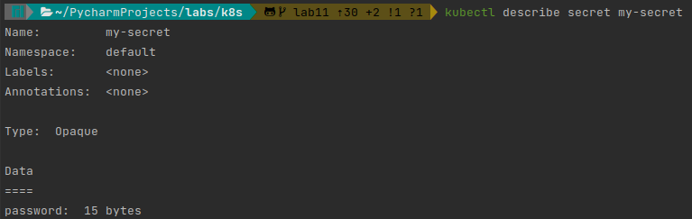
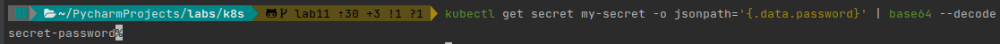
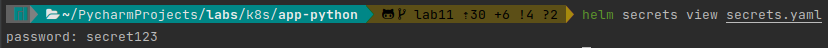
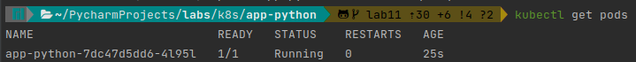
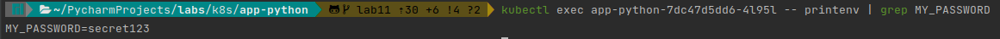

# K8S secrets

## Creating secret
#### `kubectl create secret generic my-secret --from-literal=password=secret-password`

## Verifying secret

#### `kubectl get secrets`:


#### `kubectl describe secret my-secret`


#### `kubectl get secret db-user-pass -o jsonpath='{.data.password}' | base64 --decode`



## Helm secret

#### Generating encrypted secrets.yaml
```shell
$ sops -p 431E0DF95226C99B6402B9B8C4B201C00E4F0AC6 ./secrets.yaml 
```

#### `secrets.yaml`:

```yaml
password: ENC[AES256_GCM,data:VzEA/ZaAsOJC,iv:yqlN/yjRSv7gv0B3fhuZSxwO10ky+Xwrv9O1eVBwnzg=,tag:ltTgGwzAoArNdRE/pysbFw==,type:str]
sops:
    kms: []
    gcp_kms: []
    lastmodified: '2022-11-14T15:04:21Z'
    mac: ENC[AES256_GCM,data:y4HgScyBa3+K2G9KZTOL8bdZot0ULpCkSO5r9Xhv7WZYRC2sKckUfGK+tpyKvNBy0Owk+LeGikBkCfU5UVCvrtkCn5kBBB4yycaCh7HQPIwF1t7UIVlVk3moZ6XPxzWR573c34xnJ1lxCsJEiBLKdynLzEwBz+DJ/UN0X0CEcbs=,iv:hkSP7QCdobnlCfREkvfHCz3gv5AXH1RSQKh84maIGXY=,tag:Z8IEOS6XxloutWVahdGJkg==,type:str]
    pgp:
    -   created_at: '2022-11-14T15:03:33Z'
        enc: |
            -----BEGIN PGP MESSAGE-----

            hQGMAwfz3eA8l6LHAQwAgITtEB854wge6kyBYNwWs/tswdcsOMJdD0b9nq1EY/rr
            vxu0EavrDoVJVww3j9py7C72oCqsXCgpZOmFS5O1XDI8xXhFBNgoGXjp+dIo67TG
            +77GliOUZJq0K1f4h79N8Zv8jOvuANRN3xMlOprklfL6scMcsr/Cw0+Q4j69r5zp
            9a2mtI7BaARfbDVX3ud321gmvNmPQUJpt6hNspiB9xbaokF0j+rHK78Z3G6HAhsL
            tAaM1jeIxHVStxh7jyAtOvPyo5i97Cal0XjDrpclAOO4Nnug3QdM5NNxSnMWRY5g
            6JGSiAH3EsAROgadrjYb+r5kWwgbMym/hny6g8nbZ5gR5ERFV4GUbAFFvOPY+jyn
            Mu/HuOpEYwXdVSSwMd0QLk6/0wfedvRmWEodcxkXI7upihWblS/aWlnZ9NkkZ2hM
            gGSZQ0SRa37WOE+H7zoTcVjZEBifzNBtlEXiCAXMIBvvTojlspSy/TrfQv26eeV0
            uJPX6KXU+0DvTQF7gpwX0l4BGsv9fwcwmnDrxpzHFJYe8IpL2DAnsvQJTI9TFQSO
            UDNyQDpwG0/78XMxNruHAH08OKpBGMBcNNI0LVAaL3/JEGGNSPY9o3UxH26aLLBm
            TJFJonCT0PnQDkGVLbj6
            =qRq5
            -----END PGP MESSAGE-----
        fp: 431E0DF95226C99B6402B9B8C4B201C00E4F0AC6
    unencrypted_suffix: _unencrypted
    version: 3.0.3
```

#### `helm secrets view secrets.yaml`:


#### Accessing secret
`kubectl get pods`:


`kubectl exec app-python-7dc47d5dd6-4l95l -- printenv | grep MY_PASSWORD`:


