# K8s secrets and resources - Lab 11

## Part 1 : Secrets Manually Creation

## 1.1 Steps

1. Installed Secrets using command:

> kubectl create secret generic apps-secret \
>
> --from-literal=username=AppUsername \
>
> --from-literal=password=AppPassword

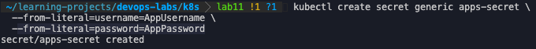

## 1.2 Results

- `kubectl get secrets`

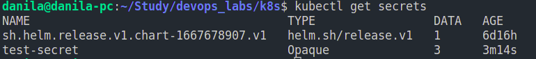

- `kubectl describe secret apps-secret`

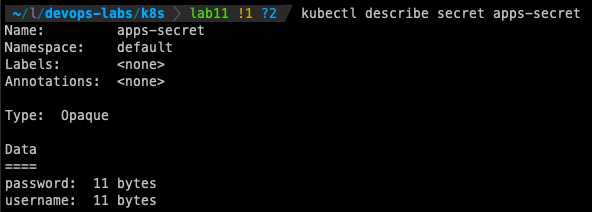

- `kubectl get secret apps-secret -o jsonpath='{.data}'`

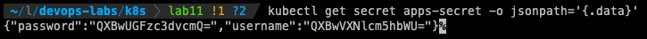

- Decoding the secrets.

For username: `echo 'QXBwVXNlcm5hbWU=' | base64 --decode`

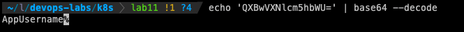

For password: `echo 'QXBwUGFzc3dvcmQ=' | base64 --decode`

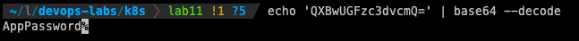

## Part 2 : Secrets with Helm

## 2.1 Steps

0. Installation (MacOS)

    0.1 Install secrets helm plugin: `helm plugin install https://github.com/jkroepke/helm-secrets` and `brew install gnu-getopt`

    0.2 Install gpg to generate keys `brew install gpg`

    0.3 Install sops `brew install sops`

1. Generating keys `gpg --gen-key` and listing them using `gpg --list-keys`. (Fingerprint is hidden :) )

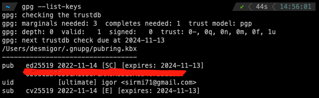

2. Generating secrets `sops -p <fingerprint> secrets.yaml`. The secret file is called `screts.yaml`

3. Installing new app `helm secrets upgrade my-app ./my-app -n default -f ./secrets.yaml`

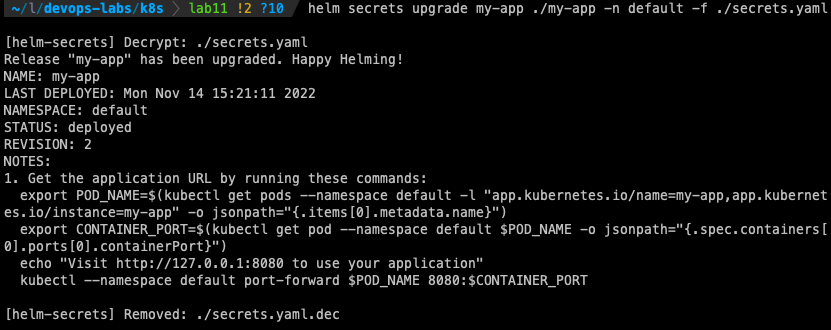

4. Checking the pods `kubectl get pods`

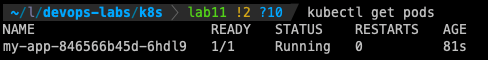

5. Checking the password `kubectl exec my-app-846566b45d-6hdl9 -- printenv | grep PASSWORD`

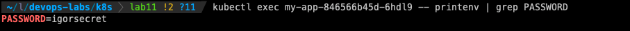

## 2.2 Checking CPU and Memory limits

`kubectl describe pod my-app | grep -A 5 Limits`

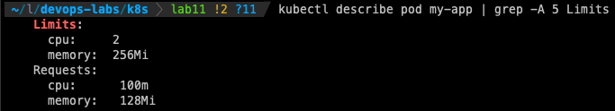