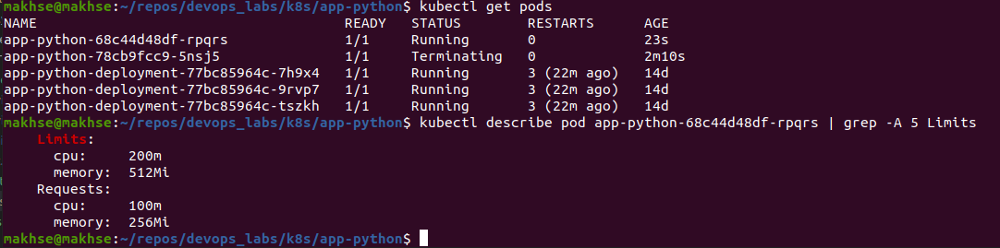

# K8s secrets and resources

## `kubctl` secrets

1. Create a secret in the cluster `kubctl`:

    ```sh
    % kubectl create secret generic secretnyi-secret \
    --from-literal=username='admin' \
    --from-literal=password='admin-pass'
    secret/secretnyi-secret created
    ```

1. Verify the secret:

    ```sh
    % kubectl get secrets
    NAME                               TYPE                 DATA   AGE
    secretnyi-secret                   Opaque               2      2m49s
    sh.helm.release.v1.app-python.v1   helm.sh/release.v1   1      6d21h
    ```

1. View the details of the secret:

    ```sh
    % kubectl describe secret secretnyi-secret
    Name:         secretnyi-secret
    Namespace:    default
    Labels:       <none>
    Annotations:  <none>

    Type:  Opaque

    Data
    ====
    password:  10 bytes
    username:  5 bytes
    ```

1. Decode the secret:

    View the contents of the secret created:

    ```sh
    % kubectl get secret secretnyi-secret -o jsonpath='{.data}'
    {"password":"YWRtaW4tcGFzcw==","username":"YWRtaW4="}% 
    ```

    Decode the password data:

    ```sh
    % echo 'YWRtaW4tcGFzcw==' | base64 --decode
    admin-pass%  
    ```

## Helm Secrets

1. Install Helm Secrets plugin:

    ```sh
    % helm plugin install https://github.com/jkroepke/helm-secrets
    Installed plugin: secrets
    ```

    ```sh
    % helm secrets help
    Secrets encryption in Helm Charts

    This plugin provides ability to encrypt/decrypt secrets files
    to store in less secure places, before they are installed using
    Helm.

    For more information, see the README at github.com/jkroepke/helm-secrets

    To decrypt/encrypt/edit you need to initialize/first encrypt secrets with
    sops - https://github.com/mozilla/sops

    Available Commands:
    encrypt Encrypt secrets file
    decrypt Decrypt secrets file
    edit    Edit secrets file and encrypt afterwards
    dir     Get plugin directory
    patch   Enables windows specific adjustments
    <cmd>   wrapper that decrypts encrypted yaml files before running helm <cmd>

    Available Options:
    --quiet                               -q  Suppress info messages (env: $HELM_SECRETS_QUIET)
    --backend                             -b  Secret backend to use for decryption or encryption (env: $HELM_SECRETS_BACKEND)
    --backend-args                        -a  Additional args for secret backend (env: $HELM_SECRETS_BACKEND_ARGS)
    --ignore-missing-values [true|false]      Ignore missing value files (env: $HELM_SECRETS_IGNORE_MISSING_VALUES)
    --help                                -h  Show help
    --version                             -v  Display version of helm-secrets
    ```

1. Install `gpg` and `sops`:

    ```sh
    % brew install gpg
    % brew install sops
    ```

    Generate keys:

    `gpg --gen-key`

1. Create secret:

    `sops -p <gpg_fingerprint> secrets.yaml`

    Create `secrets.yaml` file in `k8s/app-python/templates` folder;

    Add `env` field to `k8s/app-python/templates/deployment.yaml`.

1. Install app:

    `helm secrets install app-python ./app-python/ -f ./secrets.yaml`

    ```sh
    % helm secrets install app-python ./app-python/ -f ./secrets.yaml
    ./secrets.yaml.dec is newer than ./secrets.yaml
    NAME: app-python
    LAST DEPLOYED: Tue Nov 15 11:27:13 2022
    NAMESPACE: default
    STATUS: deployed
    REVISION: 1
    NOTES:
    1. Get the application URL by running these commands:
        NOTE: It may take a few minutes for the LoadBalancer IP to be available.
            You can watch the status of by running 'kubectl get --namespace default svc -w app-python'
    export SERVICE_IP=$(kubectl get svc --namespace default app-python --template "{{ range (index .status.loadBalancer.ingress 0) }}{{.}}{{ end }}")
    echo http://$SERVICE_IP:80
    ```

1. Get pods:
    `kubectl get pods`

    ```sh
    % kubectl get pods
    NAME                          READY   STATUS    RESTARTS   AGE
    app-python-7d5c78dcfd-b7s8q   1/1     Running   0          55s
    ```

    

1. Check secret inside pod:
    `kubectl exec app-python-7d5c78dcfd-b7s8q -- printenv | grep MY_PASSWORD`

    

## Set up requests and limits for CPU and memory

1. Set limits in `app-python/values.yaml`

1. Test that it works:
    `kubectl describe pods app-python-948cc8d8-q7rk8 | grep -A 5 Limits`

    

## Add environment variables

1. Add environment variables to `_helpers.tpl` file

1. Test that it works:

    
