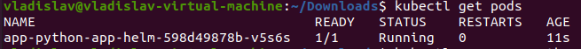

# Lab 11

## Creating secret manually

I created `apps-secret` using the following command:
```shell
kubectl create secret generic apps-secret \
  --from-literal=username=app-username-secret \
  --from-literal=password=app-secret-password
```

### Verification of the secrets

* Result of execution of the command `kubectl get secrets`:

* Result of execution of the command `kubectl describe secret apps-secret`:

* Result of execution of the command `kubectl get secret apps-secret -o jsonpath='{.data}'`:

* After decoding of `base64`:


## Creating secret using `helm`

I switched to ubuntu OS(since there was a problem with helm secrets plugin) 
and created 2 secrets using public-private keys (`gpg`) and `soap`:
```shell
username=secret-username
password=secret-password
```

### Verification of the secrets

* Result of execution of the command `kubectl get secrets`:

* Result of execution of the command `kubectl get pods`:

* Result of execution of the command `kubectl exec app-python-app-helm-598d49878b-v5s6s -- printenv | grep USERNAME`:

* Result of execution of the command `kubectl exec app-python-app-helm-598d49878b-v5s6s -- printenv | grep PASSWORD`:


## Limiting the resources(cpu and memory)

I limited resources of `app-python` and `app-java` via editing files `app-python-values.yaml` 
and `app-java-values.yaml` respectively.

* Result of execution of the command `kubectl get pods`:

* Result of execution of the command `kubectl describe pod app-python-app-helm-598d49878b-v5s6s`:


## Bonus task

I moved all env variables to the template "app-helm.envs" adding specific env variable for 
test purposes `TEST_ENV=TEST_VALUE`.

* Result of execution of the command `kubectl get pods`:

* Result of execution of the command `kubectl exec -it app-python-app-helm-7d96bdf5fc-vpd4z -- printenv`:


