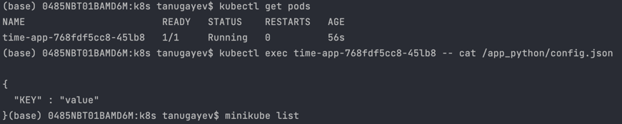
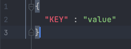
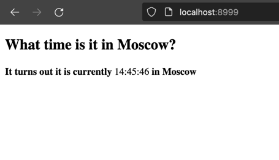

## Lab 12

### Part 1 - configmaps

- `kubectl get pods`
- `kubectl exec time-app-768fdf5cc8-45lb8 -- cat /app_python/config.json`

`config.json` looks like this:

this hopefully proves, that we are able to access the data from the config.

[//]: # (helm secrets upgrade --install time-app ./time-app -n default -f ./secrets.yaml)

### Part 2 - visits

- let us start the container and access the `/` endpoint multiple times

as we listen for accesses we store information about each visit in the array in the file

- to see the list of all visits to `/` we go to `/visits`:

### Part 3 - research

sources: official kubernetes docs:

- https://kubernetes.io/docs/concepts/workloads/controllers/statefulset/
- https://kubernetes.io/docs/concepts/services-networking/service/#headless-services
- https://kubernetes.io/docs/concepts/storage/persistent-volumes/
- https://kubernetes.io/docs/tasks/configure-pod-container/configure-persistent-volume-storage/

#### StatefulSet

StatefulSet is used to manage stateful applications. It automatically manages state/storage in pods.

StatefulSets are valuable for applications that require one or more of the following.

- Stable, unique network identifiers.
- Stable, persistent storage.
- Ordered, graceful deployment and scaling.
- Ordered, automated rolling updates.

#### Headless service

explicitly specifying "None" for the cluster IP makes it headless.
cluster ip isn't allocated for headless services. kube-proxy does not handle these services.
headless services aren't part of the load balancer don't have IP.

#### Persistent Volumes

one of the use-cases is to encapsulate storage from the end-user.
Persistent Volumes for users and administrators abstracts details
of how storage is provided from how it is consumed.

Persistent Volumes are like Volumes but have an independent lifecycle from any Pod that uses the PV.
