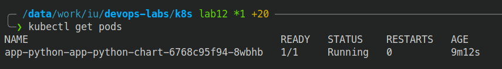
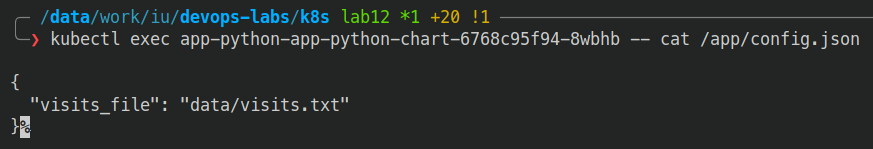

# K8s ConfigMaps

## Reading

### StatefulSet

Manages stateful applications.
Provide ordering and uniqueness guarantees for Pods.

### Headless service

Headless service is service which does not have dedicated ClusterIP.
Access to the service is done through DNS lookup, which should return
individual pod IP instead of service IP. This is useful when
we do not need load balancing or there are single-service IP addresses.

### Persistent Volumes

Persistent volumes allow us to store data independently from Pods.
They are not tied to any specific Pod and can be mounted to multiple
Pods at the same time.
