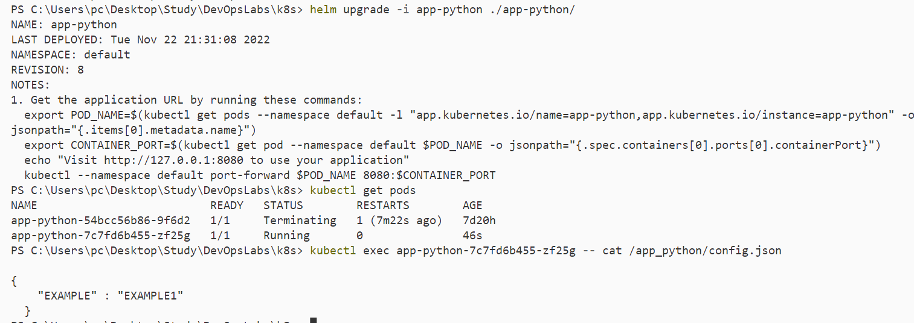

# lab 12

## Updating pod, viewing pods, checking config.json

## bonus task

### Statefulset
StatefulSet is a controller that helps you deploy and scale groups of Kubernetes pods.
Use it when you care that pods are deployed in order, that they have a persistent storage volume, or that they have a unique, stable network identifier across restarts and reschedules.

### Headless service
Service with no cluster IP address
Might be used for discovering individual pods(especially IPs) which allows another service to interact directly with the Pods instead of a proxy

### Persistent Volumes
 It is equivalent to creating a storage resource object. To use this resource, it must be requested through persistent volume claims. A persistent volume claims volume is a request for storage, which is used to mount a Persistent Volume into a Pod
 Use when we need the application pod need an access to the previously stored data, even after restarting, 