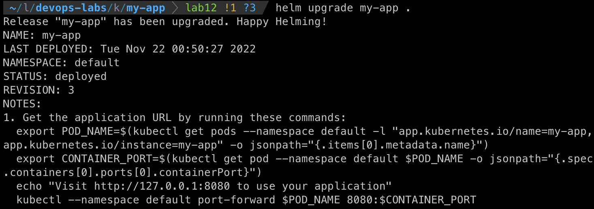
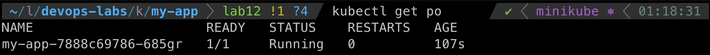
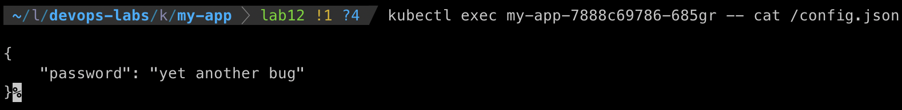

# Lab 12: K8s ConfigMaps

## 1. ConfigMaps

- `helm upgrade my-app .`

- `kubectl get po`

- `kubectl exec my-app-7888c69786-685gr -- cat /config.json`

## 2. Bonus: Theory Questions

1. StatefulSet: 

    It's a kubernetes component that is used for Stateful application. Statefull application refers to applications such as databases or any application that stores data.

2. Headless service:

    This is a term used for services that haven't an assigned Cluster IP address. This is done by setting the `ClusterIP` to `None` in the manifest file. A headless service is used in case there's no need for a load balancer and single-service IP addresses. 

3. Persistent Volumes

    This is a storage resource in a cluster created by an administator. Persistent volume's lifecycle is independent of any pod that uses/accesses it.