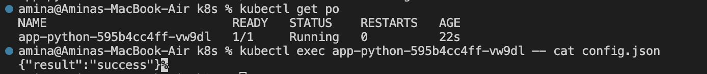
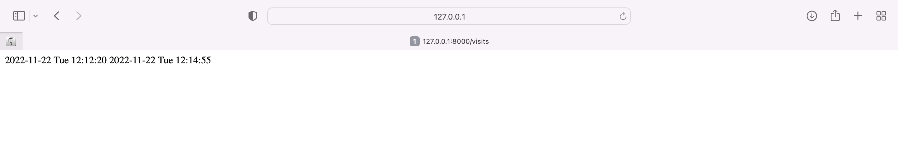

# K8s ConfigMaps

1. Install updated helm chart and test the result.
1. Get pods: `kubectl get po`
1. Check config map inside pod via `kubectl exec app-python-5d77cff49c-6hg97 -- cat /config.json`:

    

1. `/visits` endpoint:

    

## Terminology

1. `StatefulSet` is an API object that partially provides persistence for your workload. It manages the deployment and scaling of Pods, ensuring treir uniqueness and ordering. You can use the StatefulSet when you need your application to be stable and have persistent storage.
1. `Headless service` - Service that is without load-balancer and allocated a single cluster IP. Can be used when you don't want any load-balancing or routing. It also allows clients to connect directly to the pods instead via the service proxy.
1. `Persistent Volumes`- resources in the cluster like Volumes. However, they have an independent lifecycle. Using them, you can consume abstract storage resources. You may want to use them in case when the application needs some persistent data (static).
